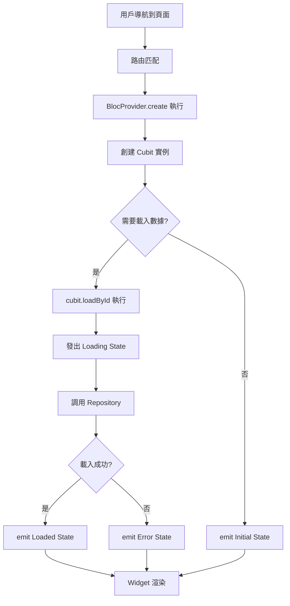

# 頁面導航與狀態管理最佳實踐

## 概述

本文檔定義了黃絲帶學習成長系統中新增頁面時應遵循的最佳實踐，特別是關於 **Bloc 狀態管理** 和 **路由導航** 的標準模式。

## 🏗️ 架構原則

### 單一職責原則
- **路由層**：負責提供正確配置的 BlocProvider
- **Widget 層**：只負責 UI 渲染和用戶互動
- **Cubit/Bloc 層**：負責業務邏輯和狀態管理

### 數據流向
```
路由參數 → BlocProvider.create → Cubit 初始化 → 數據載入 → Widget 渲染
```

## 📋 實作步驟

### 1. 創建 Cubit 和 State

#### 📁 文件結構
```
lib/domain/bloc/[feature_name]_cubit/
├── [feature_name]_cubit.dart
├── [feature_name]_state.dart
```

#### 🔧 State 定義範例
```dart
// lib/domain/bloc/student_detail_cubit/student_detail_state.dart
abstract class StudentDetailState {
  final Operate operate;
  final StudentDetail detail;

  const StudentDetailState({
    this.operate = Operate.view, 
    required this.detail
  });

  bool get isView => operate.isView;
  bool get isEdit => operate.isEdit;
  bool get isCreate => operate.isCreate;
}

class StudentDetailInitial extends StudentDetailState {
  const StudentDetailInitial({super.operate, required super.detail});
}

class StudentDetailLoaded extends StudentDetailState {
  const StudentDetailLoaded({
    required super.detail,
    super.operate = Operate.view,
  });

  StudentDetailLoaded copyWith({
    StudentDetail? detail,
    Operate? operate,
  }) {
    return StudentDetailLoaded(
      detail: detail ?? this.detail,
      operate: operate ?? this.operate,
    );
  }
}

class StudentDetailError extends StudentDetailState {
  final String message;
  
  const StudentDetailError(
    this.message, {
    super.operate, 
    required super.detail
  });
}
```

#### 🔧 Cubit 定義範例
```dart
// lib/domain/bloc/student_detail_cubit/student_detail_cubit.dart
class StudentDetailCubit extends Cubit<StudentDetailState> {
  StudentDetailCubit(super.initialState);

  Future<void> loadById(String id, {Operate operate = Operate.view}) async {
    await tryCatchWrap(() async {
      final data = await GetIt.I<DataRepo>().getById(id);
      if (data != null) {
        emit(StudentDetailLoaded(detail: data, operate: operate));
      } else {
        emit(StudentDetailError("找不到資料", detail: state.detail));
      }
    }, errorMessage: "載入資料失敗");
  }

  // 標準錯誤處理方法
  Future<void> tryCatchWrap(
    Future<void> Function() action, {
    required String errorMessage
  }) async {
    try {
      await action();
    } catch (e) {
      print('${runtimeType} error: $e');
      Fluttertoast.showToast(msg: errorMessage);
      
      if (state is LoadedState) {
        final currentState = state as LoadedState;
        emit(ErrorState(errorMessage, detail: currentState.detail));
      } else {
        emit(ErrorState(errorMessage, detail: EmptyModel()));
      }
    }
  }
}
```

### 2. 配置路由（必須遵循）

#### ✅ 正確做法：在路由層級提供 BlocProvider

```dart
// lib/flutter_flow/nav/nav.dart
FFRoute(
  name: YbRoute.featureName.name,
  path: "${YbRoute.featureName.routeName}/:operate/:id",
  builder: (context, fFParameters) {
    var params = fFParameters.state.pathParameters;
    var operate = Operate.values
        .where((o) => o.name == params["operate"])
        .first;
    var id = params['id'] ?? "";

    // ✅ 在此處提供 BlocProvider 並處理初始數據載入
    return BlocProvider<FeatureCubit>(
      create: (context) {
        final cubit = FeatureCubit(
          FeatureInitial(operate: operate, detail: EmptyModel())
        );
        
        // 根據路由參數決定是否載入數據
        if (id.isNotEmpty && operate != Operate.create) {
          cubit.loadById(id, operate: operate);
        }
        
        return cubit;
      },
      child: const FeaturePageWidget(),
    );
  },
),
```

#### ❌ 錯誤做法避免
```dart
// ❌ 不要在 Widget constructor 中處理副作用
factory FeaturePageWidget.fromRouteParams(Operate operate, String id) {
  final cubit = FeatureCubit(/* ... */);
  
  // ❌ 避免在 constructor 中執行業務邏輯
  if (id.isNotEmpty) {
    cubit.loadById(id); // 這是錯誤的！
  }
  
  return FeaturePageWidget(cubit: cubit);
}

// ❌ 不要使用 addPostFrameCallback
WidgetsBinding.instance.addPostFrameCallback((_) {
  cubit.loadById(id); // 時機不確定，難以測試
});
```

### 3. 創建 Widget

#### 🔧 Widget 基本結構
```dart
// lib/main/pages/feature_page/feature_page_widget.dart
class FeaturePageWidget extends StatefulWidget {
  const FeaturePageWidget({super.key});

  @override
  State<FeaturePageWidget> createState() => _FeaturePageWidgetState();

  // 保留 factory method 以便向後兼容
  factory FeaturePageWidget.fromRouteParams(Operate operate, String id) {
    return const FeaturePageWidget();
  }
}

class _FeaturePageWidgetState extends State<FeaturePageWidget> {
  late FeaturePageModel _model;
  final scaffoldKey = GlobalKey<ScaffoldState>();

  @override
  void initState() {
    super.initState();
    _model = createModel(context, () => FeaturePageModel());
    
    // ✅ 只做 UI 相關的初始化，不做數據載入
    logFirebaseEvent('screen_view', parameters: {'screen_name': 'FeaturePage'});
  }

  @override
  void dispose() {
    _model.dispose();
    super.dispose();
  }

  @override
  Widget build(BuildContext context) {
    return YbLayout(
      scaffoldKey: scaffoldKey,
      title: "功能頁面",
      child: BlocBuilder<FeatureCubit, FeatureState>(
        builder: (context, state) {
          if (state is FeatureLoaded) {
            return FeatureMainSection(data: state.detail);
          } else if (state is FeatureError) {
            return _buildErrorWidget(state.message);
          } else {
            // Initial 或載入中狀態
            return const Center(child: CircularProgressIndicator());
          }
        }
      ),
    );
  }

  Widget _buildErrorWidget(String message) {
    return Center(
      child: Column(
        mainAxisAlignment: MainAxisAlignment.center,
        children: [
          Icon(Icons.error, size: 64, color: Colors.red),
          SizedBox(height: 16),
          Text(message, style: TextStyle(fontSize: 16)),
          SizedBox(height: 16),
          ElevatedButton(
            onPressed: () => Navigator.of(context).pop(),
            child: Text("返回"),
          ),
        ],
      ),
    );
  }
}
```

## 🔄 標準流程圖



## 📝 檢查清單

### ✅ 路由配置
- [ ] 在 `nav.dart` 中正確配置 `BlocProvider`
- [ ] 在 `BlocProvider.create` 中處理初始數據載入
- [ ] 根據路由參數決定載入邏輯
- [ ] 添加必要的 imports

### ✅ Cubit/Bloc
- [ ] 定義清晰的 State 階層
- [ ] 實作 `loadById` 方法
- [ ] 使用標準的 `tryCatchWrap` 錯誤處理
- [ ] 適當的狀態轉換邏輯

### ✅ Widget
- [ ] Widget 不接收 Cubit 參數
- [ ] 使用 `BlocBuilder` 監聽狀態
- [ ] 處理所有可能的狀態（Initial, Loaded, Error）
- [ ] 只在 `initState` 中做 UI 初始化

### ✅ Repository
- [ ] 實作 `getById` 方法
- [ ] 適當的錯誤處理
- [ ] 返回 nullable 類型

## 🧪 測試指導

### Unit Test 範例
```dart
// test/domain/bloc/feature_cubit_test.dart
group('FeatureCubit', () {
  late MockFeatureRepo mockRepo;
  late FeatureCubit cubit;

  setUp(() {
    mockRepo = MockFeatureRepo();
    GetIt.I.registerSingleton<FeatureRepo>(mockRepo);
    cubit = FeatureCubit(FeatureInitial(detail: EmptyModel()));
  });

  test('loadById should emit loaded state when successful', () async {
    // Arrange
    const testId = 'test123';
    final testData = FeatureModel(id: testId, name: 'Test');
    when(() => mockRepo.getById(testId)).thenAnswer((_) async => testData);

    // Act
    await cubit.loadById(testId);

    // Assert
    expect(cubit.state, isA<FeatureLoaded>());
    expect((cubit.state as FeatureLoaded).detail, equals(testData));
  });
});
```

### Widget Test 範例
```dart
// test/main/pages/feature_page_test.dart
testWidgets('FeaturePageWidget should show loading initially', (tester) async {
  await tester.pumpWidget(
    MaterialApp(
      home: BlocProvider<FeatureCubit>(
        create: (_) => FeatureCubit(FeatureInitial(detail: EmptyModel())),
        child: const FeaturePageWidget(),
      ),
    ),
  );

  expect(find.byType(CircularProgressIndicator), findsOneWidget);
});
```

## 🚫 常見錯誤與避免方法

### 1. 在錯誤的地方載入數據
```dart
// ❌ 錯誤：在 Widget 的 initState 中載入
@override
void initState() {
  super.initState();
  context.read<FeatureCubit>().loadById(widget.id); // 錯誤！
}

// ✅ 正確：在 BlocProvider.create 中載入
BlocProvider<FeatureCubit>(
  create: (context) {
    final cubit = FeatureCubit(/* ... */);
    cubit.loadById(id); // 正確！
    return cubit;
  },
  child: const FeaturePageWidget(),
)
```

### 2. 忘記處理所有狀態
```dart
// ❌ 錯誤：只處理 Loaded 狀態
BlocBuilder<FeatureCubit, FeatureState>(
  builder: (context, state) {
    if (state is FeatureLoaded) {
      return DataWidget(state.detail);
    }
    return Container(); // 其他狀態呢？
  },
)

// ✅ 正確：處理所有可能的狀態
BlocBuilder<FeatureCubit, FeatureState>(
  builder: (context, state) {
    if (state is FeatureLoaded) {
      return DataWidget(state.detail);
    } else if (state is FeatureError) {
      return ErrorWidget(state.message);
    } else {
      return const LoadingWidget();
    }
  },
)
```

### 3. 不當的錯誤處理
```dart
// ❌ 錯誤：忽略錯誤或簡單的 print
try {
  await repository.getData();
} catch (e) {
  print(e); // 不夠！
}

// ✅ 正確：完整的錯誤處理
Future<void> tryCatchWrap(
  Future<void> Function() action, {
  required String errorMessage
}) async {
  try {
    await action();
  } catch (e) {
    print('${runtimeType} error: $e');
    Fluttertoast.showToast(msg: errorMessage);
    emit(ErrorState(errorMessage, detail: state.detail));
  }
}
```

## 📚 相關資源

- [Flutter Bloc 官方文檔](https://bloclibrary.dev/)
- [Go Router 官方文檔](https://pub.dev/packages/go_router)
- [專案內的 Cubit 範例](./lib/domain/bloc/student_detial_cubit/)

## 🤝 團隊約定

1. **所有新頁面** 都必須遵循此最佳實踐
2. **Code Review** 時檢查是否符合此模式
3. **遇到問題** 時先查閱此文檔
4. **建議改進** 時更新此文檔

---

*最後更新：2024年1月*
*負責人：開發團隊* 