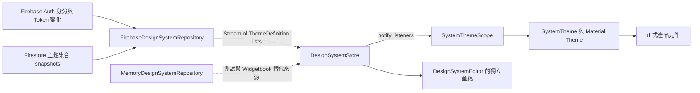
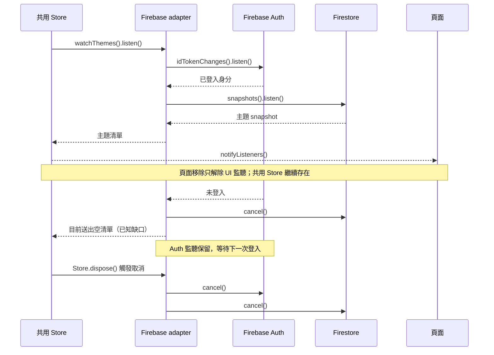

# 即時訂閱架構與生命週期：以主題系統為例

> 2026-10-03 補註（DOC-02）：本文原稿保存於 `stash@{0}`（`a3c5059`）的未追蹤檔案備份，並未遺失；已單檔取回，stash 保留。下文以 2026-09-26 程式基準解說主題架構，不是最新全站進度表。業務訂閱後續已由 `ROSTER-A3` 在 PR #8 實作、仍待驗收及合併；雙 iPad 驗收另列 `ROSTER-A3.1`。本文件是架構說明，沒有另開一套業務訂閱實作；最新規劃見 [接續紀錄](../testing/2026-09-25-login-theme.md)。

本文供團隊分享與程式碼審查使用，說明黃絲帶在下列程式快照採用的主題訂閱設計，以及業務頁面可延用的責任分工。

2026-10-03 文件交付（DOC-02／TUT-05）：本文納入 [PR #8](https://github.com/e2755699/yellow_ribbon_study_growing_system/pull/8) 供 review；新版業務串流與可攜 skill 請接著閱讀 [Cubit 訂閱改造](../knowledge-base/cubit-stream-subscription.md)。本次只交付教學，不代表主題保存問題（THEME-A1）已修正。

2026-10-03 範圍釐清：PR #8 目前主線為 ROSTER-A2.1「名冊一致性與 Firestore 整批儲存」，用 transaction 確保一次修改全部成功或全部失敗；其內的訂閱程式負責接收更新。寫入原子性與讀取即時同步是不同責任，PR 包含後者不代表全站訂閱已完成。本文解說的是主題訂閱架構，不是該交易改造的 working doc。

查核日期：2026-09-26。程式基準：`792d821`。標示「目前實作」的內容以此版本為準；「後續建議」不是已完成功能。本次文件整理沒有修改執行程式，也沒有重新驗證正式 Firebase 環境。

## 1. 先看全貌

目前的主題系統由一個 App 共用的 `DesignSystemStore` 持有訂閱。Firebase adapter 接收登入狀態與 Firestore 更新，再透過純 Dart 的 Repository 介面把主題清單交給 Store。頁面監聽 Store，不必各自連接 Firebase。



| 層級 | 責任 | 不負責的事 |
| --- | --- | --- |
| Repository 介面 | 宣告 `watchThemes()`、發布與權限查詢的契約 | 不依賴 Flutter 或 Firebase |
| Firebase adapter | 監聽 Auth／Firestore、解析文件、轉送錯誤、取消底層訂閱 | 不控制 Widget 或頁面導航 |
| Store | 持有已發布目錄、選定主題、載入／錯誤狀態，通知 UI | 不直接操作 Firebase，不保存編輯草稿 |
| Editor Cubit | 管理草稿、驗證、發布與衝突 | 草稿不直接覆蓋正式主題 |
| Scope／Widget | 根據 Store 和語意 token 重建畫面 | 正式視覺元件不直接建立 Firebase 訂閱 |

Store 使用 `ChangeNotifier`，Editor 才是 Cubit；兩者不要混為同一個物件。

## 2. `get()`、訂閱與記憶體的關係

在 2026-09-26 快照中，主要業務 Repository（學生、出席、每日表現、黃絲帶等）仍以 `get()` 讀取，尚未全面改成即時訂閱。主題系統與舊查詢頁已有串流使用，不能據此聲稱所有業務頁面都會即時更新。

```text
一次查詢：進入頁面 → get() → 結果放入 State → 畫面顯示
即時訂閱：建立訂閱 → 收到資料 → 更新 State → 畫面顯示
                       ↑ 後續更新持續走同一條流程
```

兩種方式都需要把收到的資料放進記憶體，畫面才能顯示、搜尋和操作。這與「另建本機資料庫」是不同的事。`get()` 的結果本身不會持續通知後續變更。

本文件的「記憶體資料」指 Store／State 等 Dart 物件；Firestore SDK 的磁碟快取、圖片快取和裝置持久化偏好是不同層次，沒有在此做完整快取稽核。

## 3. 程式如何接起來

### 3.1 在 App 組裝依賴並啟動

[main.dart](../../lib/main.dart) 的 `_injectDependency()` 建立共用 Repository 和 Store：

```dart
GetIt.I.registerLazySingleton<DesignSystemRepository>(() =>
    FirebaseDesignSystemRepository(
        FirebaseFirestore.instance, FirebaseAuth.instance));
GetIt.I.registerSingleton<DesignSystemStore>(
    DesignSystemStore(GetIt.I<DesignSystemRepository>())..start());
```

因此離開某個頁面不會結束共用主題訂閱。Widgetbook 則建立自己的 memory repository／Store，與正式 App 資料隔離。

### 3.2 Repository 對外只回傳領域模型

[DesignSystemRepository](../../lib/design_system/domain/design_system_repository.dart) 的讀取契約：

```dart
Stream<List<ThemeDefinition>> watchThemes();
```

上層收到的是 `ThemeDefinition` 清單，不需要知道 Firestore 的 `QuerySnapshot` 格式。這讓同一份 Store、Editor 和產品元件可以使用 Firebase 或 memory adapter。

### 3.3 Firebase adapter 管理兩個訂閱

[FirebaseDesignSystemRepository.watchThemes()](../../lib/design_system/data/firebase_design_system_repository.dart) 內部持有：

```dart
StreamSubscription<User?>? users;
StreamSubscription<QuerySnapshot<Map<String, dynamic>>>? documents;
var generation = 0;
```

- `users`：監聽 `auth.idTokenChanges()`，依身分／Token 事件重建資料訂閱。
- `documents`：監聽 `design_systems/yellow_ribbon/themes` 的 `snapshots()`。
- `generation`：辨認某一輪非同步工作是否已經過期。

以下是現有方法的核心摘錄，省略錯誤轉送和外層 `StreamController`，不是另一份可直接替換的完整實作：

```dart
users = auth.idTokenChanges().listen((user) async {
  final request = ++generation;
  await documents?.cancel();
  if (output.isClosed || request != generation) return;

  if (user == null) {
    output.add([]); // 目前行為；主題保留的已知缺口見第 6 節。
    return;
  }

  documents = firestore.collection(collectionPath).snapshots().listen((snapshot) {
    if (output.isClosed || request != generation) return;
    output.add(snapshot.docs
        .map((doc) => ThemeDefinition.fromJson(doc.id, doc.data()))
        .toList());
  });
});
```

這裡送出的是每次 snapshot 的完整主題清單，Store 會替換目前的遠端目錄，而不是逐筆套用 `docChanges`。

外層是單一訂閱的 `StreamController`。共享發生在 Store 層：多個 Widget 監聽同一個 Store，不等於多個 Widget 各呼叫 `watchThemes()`。若另外建立 Store 並訂閱，仍會建立另一組底層監聽。

### 3.4 Store 更新狀態，UI 重建

[DesignSystemStore.start()](../../lib/design_system/application/design_system_store.dart) 先防止重複啟動，再持有上層訂閱：

```dart
if (_subscription != null || _disposed) return;
_subscription = repository.watchThemes().listen((themes) {
  if (_disposed) return;
  _remote = {for (final theme in themes) theme.id: theme};
  loaded = true;
  loadError = null;
  notifyListeners();
}, onError: (Object error) {
  if (_disposed) return;
  loaded = false;
  loadError = '雲端主題讀取失敗，目前使用可用的配色。請檢查連線與存取權限。';
  notifyListeners();
});
```

讀取錯誤會標記狀態，這個分支沒有清空 `_remote`。`retry()` 會等待原訂閱取消、清除持有欄位，再重新啟動。此錯誤提示與手動重試機制，不代表所有錯誤都已自動恢復。

[SystemThemeScope](../../lib/design_system/presentation/system_theme_scope.dart) 使用 `AnimatedBuilder(animation: store, ...)` 接收通知，再把 `store.active` 轉成 `SystemTheme`。正式元件讀 `SystemTheme.of(context)`，不直接存取 GetIt 或 Firebase。

## 4. 生命週期：誰持有，誰取消



| 所有者／資源 | 目前取消方式 | 何時發生 |
| --- | --- | --- |
| Store 的 `_subscription` | `dispose()` 呼叫 `cancel()`；`retry()` 會等待取消 | Store 被釋放或使用者重試 |
| Adapter 的 `users`、`documents` | 輸出串流的 `onCancel` 取消兩者 | Store 取消上層訂閱 |
| 舊身分的 Firestore 訂閱 | 每次 Auth 事件先取消 `documents` | 登出、換帳號或 Token 事件 |
| Scope 的 Store 監聽 | 由 `AnimatedBuilder` 生命週期管理 | Scope 移除或更換監聽物件 |
| 首頁手動 Store listener | `dispose()` 呼叫 `removeListener` | 首頁被移除 |
| Editor 手動 Store listener | `close()` 呼叫 `removeListener` | Editor Cubit 關閉 |

Adapter 的取消回呼如下：

```dart
onCancel: () async {
  generation++;
  await users?.cancel();
  await documents?.cancel();
}
```

`generation` 的用途可以用換帳號理解：A 那一輪記住 `request = 1`，B 的事件把 `generation` 改成 2；A 的舊回應即使晚到，檢查不相等就忽略。`cancel()` 停止訂閱，generation 檢查則防止過期工作繼續套用；兩者各有用途。

這是目前的防護意圖與程式路徑，不代表所有快速切換、取消期間交錯的競態都已經過整合測試。

App 的 Store 註冊為 singleton，目前 composition root 沒有額外註冊 GetIt disposal callback。不能假設「離開頁面」或「GetIt unregister」就一定執行 Store 的 `dispose()`；若未來加入 App scope 重建或測試 teardown，必須由擁有者明確處理。程序被作業系統終止，也不能視為一定會執行 Dart 的 `dispose()`。

## 5. 團隊延用到業務頁面時的責任分工

以下是從主題案例抽出的責任分工建議。PR #8 的業務訂閱實作另見新版 Cubit 教學；本節不作為最新完成狀態。

| 資料用途 | 建議擁有者 | 生命週期 |
| --- | --- | --- |
| 單一學生詳情、單日出席等頁面資料 | 頁面 Cubit | 路由建立時訂閱；Cubit `close()` 取消 |
| 全 App 共用的主題目錄 | 共用 Store | 跨頁保留；依登入狀態控制雲端連線 |
| 單純顯示一條串流的區塊 | `StreamBuilder` | 元件管理訂閱與取消 |
| 表單未儲存的輸入 | 頁面草稿狀態 | 與遠端已儲存資料分開，避免更新覆蓋輸入 |

使用 `BlocProvider(create: ...)` 建立的 Cubit，會在 provider 移除時關閉；但 Cubit 手動建立的 `.listen()` 仍須在自己的 `close()` 裡取消。`BlocProvider.value` 不接管外部 Cubit 的關閉責任，應由建立它的所有者釋放。

「切到另一頁」也不一定等於原頁被移除：原頁若仍在返回堆疊中，Cubit 和訂閱可以繼續存在。是否在被遮住時暫停訂閱，是另一個產品／資源使用決策。

改造有篩選條件的業務頁面時，要一起定義：日期／班級改變後如何取消舊來源、忽略舊回應，以及遠端更新如何與未儲存草稿協調。現有保存失敗保留草稿的行為不能被新訂閱破壞。

## 6. 2026-09-26 快照的界線與已知缺口

| 項目 | 查核結果 |
| --- | --- |
| 主題即時訂閱、Store／UI 分層 | 已有實作 |
| 主題串流取消、過期回應檢查、錯誤狀態與重試入口 | 已有程式路徑；不能等同完整競態驗收 |
| Memory adapter 與草稿隔離 | 已有實作，Widgetbook 不初始化 Firebase |
| 學生、出席、每日表現、黃絲帶的全面即時更新 | 尚未完成，主要 Repository 仍使用 `get()` |
| 登出／未登入保留完整自訂主題 | 尚未完成；目前只持久化主題 ID |
| 正式 Firebase 跨裝置／帳號切換驗收 | 本文件未執行；部署與權限狀態見 Design System 文件 |

目前主題保留問題的來源是：Auth 回報未登入 → adapter 送出 `[]` → Store 把 `_remote` 換成空目錄。裝置只保存 `home_color_theme` ID；內建主題還能從 bundled defaults 取得，自訂主題則會回退到預設主題。若修改的是內建 ID 的雲端版本，也會退回該內建種子值。**此流程沒有刪除 Firestore 文件。**

後續方向是把最後選用的完整已發布主題保存到裝置，登入後再同步更新；未登入時停止受保護的雲端讀取，但保留外觀設定。需要明確區分「尚未取得／未登入」和「成功取得空目錄」，避免把兩者都當成刪除已知主題。未發布草稿仍保持隔離。這是待實作方向，不能直接把目前的 `output.add([])` 當成團隊共用範本。

## 7. 驗證與分享時的檢查重點

現有測試可從 [design_system_test.dart](../../test/design_system_test.dart)、[custom_themes_test.dart](../../test/custom_themes_test.dart)、[login_theme_test.dart](../../test/login_theme_test.dart) 閱讀，涵蓋主題發布／草稿隔離、衝突、自訂目錄與 UI 主題傳遞等情境。Memory 測試通過，不等於已驗證真實 Firebase Auth 切換與所有取消競態。

後續訂閱改造的驗收至少應包含：

- 第一筆資料、後續更新、空集合、解析失敗、權限／連線錯誤及重試。
- 同一擁有者重複啟動不增加訂閱；重新進頁面建立新訂閱。
- 真正移除頁面後底層訂閱取消；被下一頁蓋住時的行為符合設計。
- 快速換帳號／篩選條件，舊回應不覆蓋新狀態；取消期間不建立遺留訂閱。
- 取消後不再更新已關閉的 Cubit／Store；測試 teardown 沒有留下監聽。
- 遠端更新不覆蓋未儲存草稿；儲存失敗仍可重試。
- 主題修正後，登出、離線重開仍保留完整已發布配色，登入後能取得新版本。

分享時可依「資料來源與 State → 層級責任 → 更新流程 → 取消生命週期 → 現況與待辦」的順序說明。Code review 最先確認三件事：誰擁有訂閱、何時取消、舊回應如何失效。

## 原始碼與相關文件

- [Repository 契約](../../lib/design_system/domain/design_system_repository.dart)
- [Firebase adapter](../../lib/design_system/data/firebase_design_system_repository.dart)
- [Memory adapter](../../lib/design_system/data/memory_design_system_repository.dart)
- [共用 Store](../../lib/design_system/application/design_system_store.dart)
- [Editor Cubit](../../lib/design_system/application/design_system_editor.dart)
- [主題 Scope](../../lib/design_system/presentation/system_theme_scope.dart)
- [App 依賴組裝](../../lib/main.dart)
- [路由與頁面 Cubit 建立](../../lib/flutter_flow/nav/nav.dart)
- [學生 Repository：連結指向所在分支，歷史 get 行為以 792d821 為準](../../lib/domain/repo/students_repo.dart)
- [Design System 與部署限制](../design-system.md)
- [頁面導航與狀態管理](page_navigation_and_state_management.md)
