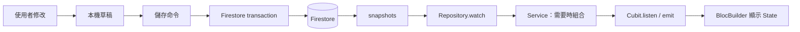
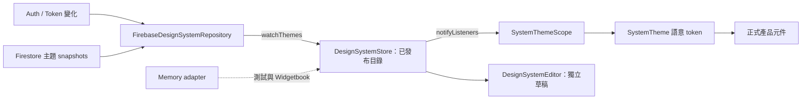

# 即時訂閱架構：從資料更新到畫面與生命週期

原主題教學 [TUT-05][theme-guide] 已由 PR #8 的 `a263265` 交付；本篇由 PR #19 補充，使用不同檔名，保留原稿與原有連結。

這份文件供團隊分享：先理解資料如何更新，再看「App 共用主題」與「頁面業務資料」如何各自管理訂閱。細部 Cubit 改造與可攜範例另見 [Cubit 訂閱教學][cubit-guide]，不需要再建立一套重複的業務訂閱。

核對日期：2026-10-03。文件任務：**DOC-02**；本篇是 TUT-04／TUT-05 的補充總覽，不另算一套教學或 skill。

| 說明範圍 | 程式基準 | 狀態 |
| --- | --- | --- |
| App 共用主題 | master `715428b` | 已有 Store／Repository 訂閱；完整自訂主題的裝置保存尚未實作 |
| 學生／每日名冊／歷史業務資料 | [PR #8][pr8] `82bc544` | 已有讀取訂閱，也有整批 transaction；核對時 PR 仍 OPEN |
| 本次文件交付 | 靜態追蹤來源、呼叫點及取消路徑 | 沒有修改產品程式、重跑 App 測試或執行雙 iPad 驗收 |

PR 來源連結固定至核對的 commit，讓 master 尚未合併時也能閱讀。文件描述的是該快照，不代表最新部署版本；全站覆蓋與實機驗收不可從單一 PR 的存在推定。

## 目前程式位置（2026-10-04 補充）

PR #8 `e041766` 已沿用既有分層：[DailyRosterCubit](../../lib/domain/bloc/daily_roster_cubit/daily_roster_cubit.dart)、[StudentHistoryCubit](../../lib/domain/bloc/student_history_cubit/student_history_cubit.dart)、[每日服務](../../lib/domain/service/daily_roster_service.dart)、[Firebase Repository](../../lib/domain/repo/firebase_roster_repository.dart)、[SharedStreamCache](../../lib/domain/utils/shared_stream_cache.dart)、[交易 adapter](../../lib/domain/repo/firebase_roster_commands.dart)。資料流與取消所有權未因搬移改變。

下文固定 commit 的連結仍指向原教學快照；閱讀現在的目錄請用以上連結。當前驗證是 App 217、Widgetbook 62 及設計系統 gate 通過，詳細紀錄見 [工作紀錄](../testing/2026-10-02-student-roster-integrity.md)，不代表雙 iPad 實機驗收完成。

## 1. PR #8 同時處理讀取與寫入

老師 A 開著學生頁面，老師 B 修改資料並儲存：交易負責讓 B 相關的寫入保持一致，訂閱負責讓 A 收到後續資料更新。

| 責任 | 解決什麼問題 | 不足以證明什麼 |
| --- | --- | --- |
| 讀取訂閱 | 初次結果後持續接收更新，Cubit 更新畫面 State | 不保證多筆寫入一起成功 |
| 整批 transaction | 同一儲存命令涉及的紀錄、點數／緞帶、事件、收據一起成功或失敗 | 不會讓已結束的 `get()` 自動變成即時更新 |

`DailyRosterCubit` 經 `repository.command(...)` 儲存；[Firebase command store][commands] 使用 `runTransaction`。收到串流事件與儲存成功是兩個訊號，儲存結果仍須依 command 回覆及其確認機制處理。寫入逾時表示結果未確認，不能直接當成伺服器沒有寫入。

## 2. 從建立訂閱到畫面更新

建立方向是「頁面／路由建立 Cubit → Cubit 訂閱 Service／Repository」。資料回來的方向是「Firestore → Repository → Service → Cubit → Widget」。Widget 重建不需要重新建立這條訂閱。

| 層 | 責任 | 實際例子 |
| --- | --- | --- |
| 資料來源 | 產生初始及後續資料事件 | `FirebaseRosterRepository._query` 的 `snapshots(includeMetadataChanges: true)` |
| Repository | 查詢條件、身分／權限範圍、資料解析及共享來源 | `watchStudents`、`watchEnrollments`、`watchRecords`、`watchSessions` |
| Service | 組合多份來源，產生頁面需要的領域資料 | `DailyRosterService.watch(date, locationId)` |
| Cubit | 持有訂閱，處理載入／資料／錯誤與草稿，輸出 State | `DailyRosterCubit`、`StudentsCubit` |
| Widget | 根據 State 顯示內容；操作交回 Cubit | `BlocBuilder` 與正式頁面元件 |

Service 並非每一頁必經：學生列表也會直接訂閱 `StudentsRepo`。PR 仍有 GetIt 呼叫與相容入口，這不是宣稱整個專案已全面改成純 constructor injection。

已逐項追蹤的讀取路徑：

| 功能 | 真正的訂閱入口 | 補充 |
| --- | --- | --- |
| 學生列表 | `StudentsCubit.load()` → `StudentsRepo.watch().listen(...)` | 另訂閱權限、據點與緞帶數量；方法叫 load 不代表只讀一次 |
| 學生詳情 | `StudentDetailCubit` → `StudentsRepo.watchById(...)` | 另有在籍期間與緞帶來源；遠端資料與表單草稿分開處理 |
| 每日出席／表現 | `DailyRosterCubit` → `DailyRosterService.watch(date, locationId)` | 組合學生、在籍期間、出席、表現、課堂五條來源 |
| 學生月歷史 | `StudentHistoryCubit` → `StudentHistoryService.watchMonth(...)` | 依學生及月份訂閱 |
| 詳情近期活動 | 路由建立 `StudentActivityCubit.watching` → `StudentHistoryService.watchRecent(sid)` | 新增學生模式用空資料，不查不存在的學生 |

[每日名冊 Service][daily-service] 使用 `combineLatestAll`：等每份來源有初始資料，再用各來源最新值組出名冊；後續任一來源更新會重新組合。多條查詢的合併結果不保證屬於資料庫完全相同的一瞬間，不可把這個組合當成跨查詢的原子快照。

`StudentsRepo.load()`／`getById()` 仍提供 `watch().first` 類型的相容入口；它們只取第一筆。`Stream.fromFuture` 也只送一次結果，不會把一次查詢變成真正即時來源。判斷是否即時更新，要追到正式呼叫者與底層來源，不能只看回傳型別是 Stream。

來源：[PR 業務目錄][roster-source]、[學生 Cubit][students-cubit]、[路由組裝][routes]。

## 3. 記憶體、共享快取與取消

即使每次開頁都 `get()`，取得的資料仍要成為 Dart 物件／State，畫面才能顯示與編輯。訂閱則是在新事件到來時更新這些物件。這與另外建立一個本機資料庫是不同的事。

| 資料所在位置 | 誰管理 | 生命週期 |
| --- | --- | --- |
| 畫面 State、頁面表單 | 頁面 Cubit | 跟著其 provider／擁有者；草稿另外依產品規則保存 |
| `SharedStreamCache` 最近結果與來源 | Repository | 跨同 key 訂閱者共享；最後一位取消時停止來源，最近結果可能保留 |
| Firestore SDK 快取 | Firebase SDK | 不是 Cubit 的 State；本文件未稽核其所有磁碟快取設定 |
| `home_color_theme` 偏好 | SharedPreferences | 跨程序保留；目前只有主題 ID |

[SharedStreamCache][cache] 的實際流程：

1. 相同 key 的訂閱者共用一個來源；新訂閱者可先取得最近結果。
2. 某個 Cubit 取消時，只解除自己的訂閱；其他訂閱者仍可接收資料。
3. 最後一個訂閱者取消時，cache 取消來源。最近結果可能留在記憶體，之後先以快取狀態送出，再接回來源。
4. cache 超過容量時只移除閒置項目；`clear()` 則清除結果並取消來源。因此預設 capacity 32 不是「所有活躍查詢最多 32 個」的硬限制。

`FirebaseRosterRepository` 的 query key 包含 uid、權限輪次與查詢條件，身分／權限切換會清理舊 scope。這是該 Repository 的設計，不能推論全 App 的所有 listener 都已共享或所有快取都已稽核。

使用 `BlocProvider(create: ...)` 建立的 Cubit，在 provider 移除時關閉；Cubit 自己建立的 `.listen()` 由自己的 `close()` 取消。`BlocProvider.value` 不接管外部 Cubit 的關閉責任。

**切到另一頁不一定代表原頁已被移除。** 原頁仍在返回堆疊時，Cubit 和訂閱可能繼續存在。頁面被覆蓋時要不要暫停訂閱，是另一項產品決策，不能用「離頁就一定釋放」概括。

## 4. 切換、錯誤與草稿

`DailyRosterCubit` 更換日期／據點時先取消舊訂閱，並用 generation 辨認過期的非同步工作。generation 是本機工作輪次，不是資料庫 revision，也不替代權限檢查或 `cancel()`。

不同 Cubit 的契約不完全相同：核對版本的 `StudentActivityCubit.load()` 已是 `void`，只啟動訂閱，沒有 Completer／generation；`StudentsCubit.load()` 仍等待初次結果。不能把某一個 Cubit 的寫法規定成全專案必備模板。

每日頁面收到新名冊時更新 remote 資料，使用者的修改保留在 drafts；顯示值由 remote 與草稿 patch 組成。儲存確認還會透過 revision 協調回覆與訂閱結果，避免較舊的回覆倒退畫面。詳細業務規則見 [每日名冊與出席][daily-guide]。

PR 的 [初次回應期限][timeout] 是 60 秒：等不到有效初次回應時送出錯誤；持續訂閱不因閒置 60 秒而斷掉，逾時後仍可接收恢復事件。需要 server 確認的來源另傳 `isReady` 條件，不能拿任意 cache 事件當作授權已確認。此處描述 helper 與其呼叫方式，不代表所有斷網情境已驗收。

## 5. 對照：全 App 共用的主題訂閱

主題使用 App 共用的 `DesignSystemStore`（ChangeNotifier），不是每頁各一個 Cubit。`DesignSystemEditor` 才是管理編輯草稿的 Cubit。

[Store][theme-store] 持有 `watchThemes()` 訂閱，替換已發布目錄後通知 UI。[Scope][theme-scope] 監聽 Store，提供正式元件使用的 SystemTheme；元件不自行連 Firebase。主題共享發生在 Store，多個 Widget 監聽同一個 Store，不會各自呼叫 `watchThemes()`。

| 所有者 | 取消責任 |
| --- | --- |
| `DesignSystemStore` | `dispose()` 觸發取消；`retry()` 等待取消後重建 |
| Firebase adapter | Auth 事件切換時取消舊文件訂閱；輸出取消時取消 Auth 與文件訂閱 |
| Scope／頁面／Editor | 解除自己對 Store 的監聽；不因某頁離開而銷毀 App 共用 Store |

App 目前將 Store 註冊為 singleton；不能假設離頁或 GetIt unregister 必定執行其 dispose。若未來重建 App scope，仍須指定釋放責任。

主題草稿在 Editor 內，明確發布後才影響共用目錄。Widgetbook 使用獨立 memory adapter，展示不讀正式學生資料，也不初始化 Firebase。

## 6. 登出：已確認方向與尚未完成的主題保存

已確認方向是「登出保留裝置主題偏好」；頁面資源沿既有生命週期釋放。尚未決定的完整登出流程、未儲存修改及進行中寫入處置，不能從這份訂閱說明自行補成產品規格。

目前 [主題 adapter][theme-adapter] 的行為是：未登入 → 取消舊文件訂閱 → 送出空目錄 → Store 替換 `_remote`。裝置只有 `home_color_theme` ID，自訂主題失去內容後會回退到內建值。**這沒有刪除 Firestore 的主題文件。**

THEME-A1 追蹤保存完整已發布主題的後續工作，目前未實作。不要把上述已知缺口教成「登出應清掉主題」的規則；停止帳號資料讀取與保留裝置外觀偏好是可以分別處理的責任。

## 7. 團隊分享與 review 順序

建議用 10–15 分鐘依序說明：

1. 以兩位老師的例子區分「寫入一致」與「讀取即時」。
2. 沿正式呼叫鏈走一次：路由／Cubit → Repository／Service → snapshots → State → Widget。
3. 指出每個 subscription 的擁有者、scope、取消時機及共享來源。
4. 說明遠端更新為何不該清掉草稿，以及快取與權限的邊界。
5. 對照 App 共用主題 Store，再列出尚待驗證與尚未實作的部分。

本次文件已靜態核對上列呼叫鏈、共享快取、取消、草稿、主題與 transaction 的來源。**文件核對完成不等於功能驗收完成。** 後續驗收應檢查初始／後續事件、error／retry、移除頁面、切帳號／範圍、取消中的重啟、共享來源最後一位離開，以及遠端更新與未儲存草稿並存。

既有測試入口在 [PR 測試目錄][tests]，包含 `domain/roster/shared_stream_cache_test.dart`、`daily_roster_cubit_test.dart`、`student_history_service_test.dart` 與 `request_timeout_test.dart`。此輪沒有執行這些測試。ROSTER-A3.1 的雙 iPad 驗收依核對日看板仍為 0/10，不能把寫好的案例算作通過。

深入閱讀：[Cubit 改造教學與 skill][cubit-guide]、[每日名冊業務規則][daily-guide]、[Design System](../design-system.md)、[知識庫索引](../knowledge-base/README.md)。

[pr8]: https://github.com/e2755699/yellow_ribbon_study_growing_system/pull/8
[cubit-guide]: https://github.com/e2755699/yellow_ribbon_study_growing_system/blob/82bc544ffffb46b72870b128351998441838f7ee/docs/knowledge-base/cubit-stream-subscription.md
[daily-guide]: https://github.com/e2755699/yellow_ribbon_study_growing_system/blob/82bc544ffffb46b72870b128351998441838f7ee/docs/knowledge-base/daily-attendance.md
[roster-source]: https://github.com/e2755699/yellow_ribbon_study_growing_system/tree/82bc544ffffb46b72870b128351998441838f7ee/lib/domain/roster
[students-cubit]: https://github.com/e2755699/yellow_ribbon_study_growing_system/blob/82bc544ffffb46b72870b128351998441838f7ee/lib/domain/bloc/student_cubit/student_cubit.dart
[routes]: https://github.com/e2755699/yellow_ribbon_study_growing_system/blob/82bc544ffffb46b72870b128351998441838f7ee/lib/flutter_flow/nav/nav.dart
[daily-service]: https://github.com/e2755699/yellow_ribbon_study_growing_system/blob/82bc544ffffb46b72870b128351998441838f7ee/lib/domain/roster/daily_roster_service.dart
[cache]: https://github.com/e2755699/yellow_ribbon_study_growing_system/blob/82bc544ffffb46b72870b128351998441838f7ee/lib/domain/roster/shared_stream_cache.dart
[commands]: https://github.com/e2755699/yellow_ribbon_study_growing_system/blob/82bc544ffffb46b72870b128351998441838f7ee/lib/domain/roster/firebase_roster_commands.dart
[timeout]: https://github.com/e2755699/yellow_ribbon_study_growing_system/blob/82bc544ffffb46b72870b128351998441838f7ee/lib/domain/utils/request_timeout.dart
[tests]: https://github.com/e2755699/yellow_ribbon_study_growing_system/tree/82bc544ffffb46b72870b128351998441838f7ee/test
[theme-store]: https://github.com/e2755699/yellow_ribbon_study_growing_system/blob/715428b0555a6efee5570cd35a8676c800ebe9b9/lib/design_system/application/design_system_store.dart
[theme-adapter]: https://github.com/e2755699/yellow_ribbon_study_growing_system/blob/715428b0555a6efee5570cd35a8676c800ebe9b9/lib/design_system/data/firebase_design_system_repository.dart
[theme-scope]: https://github.com/e2755699/yellow_ribbon_study_growing_system/blob/715428b0555a6efee5570cd35a8676c800ebe9b9/lib/design_system/presentation/system_theme_scope.dart

[theme-guide]: https://github.com/e2755699/yellow_ribbon_study_growing_system/blob/a263265967df83dcb6979662458ea86633db1ddc/docs/best_practices/realtime_subscription_architecture.md
