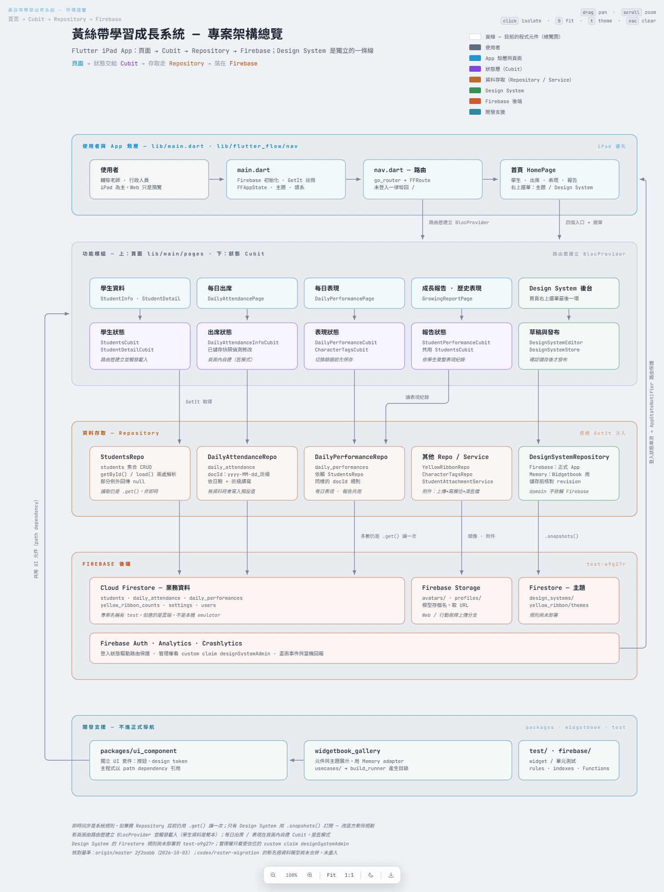

# 專案架構總覽

核對日期：2026-10-03（Asia/Taipei）。程式基準：`origin/master` `2f2aabb`。本篇給第一次接觸專案的人快速掌握分層與資料流，不展開到單一頁面的細節。



互動版：直接用瀏覽器開啟 [architecture/index.html](architecture/index.html)，可拖曳、縮放，點方塊看說明。編輯器或聊天側邊的預覽可能不執行頁面腳本而顯示空白，請改用瀏覽器開啟或看上方 PNG。

## 已確認規則

以下規則來自 `CLAUDE.md`，是新程式要遵守的方向：

- 標準資料流：路由參數 → `BlocProvider.create` → Cubit 載入 → Repository → State → Widget。初始資料載入由路由層觸發，不放在 Widget 的 `initState`。
- Cubit 只透過 Repository / Service 存取資料；需要 GetIt 的 Repository 在 `main.dart` 的 `_injectDependency()` 註冊。
- 即時同步是系統不動規則：畫面資料應使用 Firestore `.snapshots()` 訂閱。
- Design System 的 domain／Cubit 不依賴 Firebase，只透過 `DesignSystemRepository`；主題資料獨立放在 `design_systems/yellow_ribbon/themes`。
- 正式首頁只有四個業務入口；元件展示、Widgetbook 與開發工具不進正式導航。

## 目前實作

由上到下五層：

| 層 | 主要位置 | 內容 |
| --- | --- | --- |
| 使用者與 App 殼層 | `lib/main.dart`、`lib/flutter_flow/nav/nav.dart` | 啟動與 GetIt 註冊；`go_router` 路由，`AppStateNotifier` 監聽 Auth，未登入導回 `/`；首頁四入口與右上選單 |
| 功能模組 | `lib/main/pages/`、`lib/domain/bloc/`、`lib/design_system/application/` | 學生資料、每日出席、每日表現、成長報告／歷史表現四個業務模組，加上 Design System 後台；每個模組是「頁面＋Cubit」 |
| 資料存取 | `lib/domain/repo/`、`lib/domain/service/`、`lib/design_system/data/` | `StudentsRepo`、`DailyAttendanceRepo`、`DailyPerformanceRepo`、`YellowRibbonRepo`、`CharacterTagsRepo`、`StudentAttachmentService`；主題走 `DesignSystemRepository`（Firebase / Memory 兩個 adapter） |
| Firebase 後端 | 雲端專案 `test-o9g27r` | Firestore 業務集合 `students`、`daily_attendance`、`daily_performances`、`yellow_ribbon_counts`、`settings`、`users`；Storage `avatars/`、`profiles/`；主題集合；Auth、Analytics、Crashlytics |
| 開發支援 | `packages/ui_component/`、`widgetbook_gallery/`、`test/`、`firebase/` | 共用 UI 套件、元件展示（Memory adapter）、測試、rules／indexes／Functions |

模組與資料的對應：

| 模組 | Cubit | 主要資料來源 |
| --- | --- | --- |
| 學生資料 | `StudentsCubit`、`StudentDetailCubit`、`StudentActivityCubit` | `StudentsRepo`；附件走 `StudentAttachmentService` |
| 每日出席 | `DailyAttendanceInfoCubit` | `DailyAttendanceRepo` |
| 每日表現 | `DailyPerformanceCubit`、`CharacterTagsCubit` | `DailyPerformanceRepo`、`CharacterTagsRepo` |
| 成長報告／歷史表現 | `StudentPerformanceCubit`，列表共用 `StudentsCubit` | `DailyPerformanceRepo`、`StudentsRepo` |
| Design System 後台 | `DesignSystemEditor`（草稿）、`DesignSystemStore`（已發布） | `DesignSystemRepository` |

## 缺口與待決定

- **即時同步須區分版本**：本篇 master 基準的主要業務讀取仍為一次性查詢；PR #8 `82bc544` 已有學生、名冊、歷史等訂閱及取消路徑，同時包含整批交易。PR 尚未合併，雙 iPad 驗收另行追蹤，詳見 [即時訂閱架構](../best_practices/realtime_subscription_architecture.md)。
- **舊頁面模式**：每日出席／每日表現的 Cubit 在頁面內建立，與「路由層建立 BlocProvider」的規則不同；學生資料才是新頁面範本。
- **Design System 規則未部署**：主題集合的 Firestore 規則尚未部署到 `test-o9g27r`，管理權依 custom claim `designSystemAdmin`。
- **名冊資料模型尚未合併**：每日名冊與出席的知識文章（已在 PR #8、未合併至 master）描述的 `student_enrollments`、`attendance_records` 等新模型在 `codex/roster-migration` 分支，截至本篇核對時未進 `origin/master`，所以架構圖仍是舊的 `daily_attendance` 集合。合併後須更新本篇與圖。

## DOC-02：團隊訂閱架構分享（2026-10-03）

[分享總覽](../best_practices/realtime_subscription_architecture.md) 已依 master `715428b` 的主題實作與 PR #8 `82bc544` 的業務實作整理。PR #8 同時包含讀取訂閱與整批交易，不再把已存在的業務訂閱列為待重新實作；文件分清頁面 Cubit、Repository 共享快取及 App 共用 Store 的生命週期。

總覽連至 PR 已有的 Cubit 深入教學與每日名冊規則，程式連結固定 commit，避免 master 尚無該檔時產生斷鏈。DOC-02 僅交付文件；THEME-A1 的完整主題裝置保存、ROSTER-A3.1 雙 iPad 驗收仍各自追蹤。本輪只核對文件與程式來源，沒有重跑 App 測試或部署。

## 更新架構圖

圖由 `.claude/skills/code-review-canvas` 產生，資料在 [architecture/scene.js](architecture/scene.js)。修改 scene 後在 repository 根目錄執行：

```sh
node .claude/skills/code-review-canvas/scripts/validate.js docs/knowledge-base/architecture/scene.js
node .claude/skills/code-review-canvas/scripts/build.js --scene docs/knowledge-base/architecture/scene.js --out docs/knowledge-base/architecture/index.html --title "黃絲帶學習成長系統 — 架構總覽" --kicker "黃絲帶學習成長系統 — 架構總覽" --sub "<b>頁面</b> → <b>Cubit</b> → <b>Repository</b> → <b>Firebase</b>" --slug yb-architecture
```

再用瀏覽器開啟 `index.html` 確認畫面並重新截取 `overview.png`；同時更新本篇的核對日期與程式基準。
