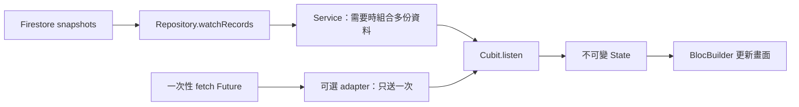

# Cubit 從讀一次改為訂閱：為什麼、怎麼改、如何驗證

## 2026-10-06 UI-A4：學生表單離頁依實際內容判斷

- 使用者確認：未修改直接返回；修改後還原亦不應詢問。先前將 edit／create 等同未儲存是實作缺陷，不是需求。
- StudentDetailCubit 比較載入／成功儲存基準與目前 profileValues，新增模式另比較據點與入班日期。表單在離頁當下透過既有 onSaved 收集本機值，不驗證、不寫後端；SystemPage／YbLayout 的 hasUnsavedChanges 回呼取得即時結果。
- 已獨立儲存的附件不算表單草稿。儲存／上傳中阻止離開；新增結果未知仍保留確認，不能因使用者還原欄位就當作從未送出。暫時訂閱錯誤維持原草稿與比較基準；明確撤權仍清除個資。
- 實作與驗證見 [UI-A4 紀錄](../testing/2026-10-06-student-unsaved-exit.md)。自動測試與 iPad 使用者驗收分開；本輪未部署、未更新 TestFlight、未合併。


核對日期：2026-10-03。需求來自 PR #8 的 StudentActivityCubit review：使用者理解 Future → Stream adapter 後，要求整理成知識庫與可分享、可改造其他專案的 skill。

可用入口：[$cubit-stream-subscription](../../.claude/skills/cubit-stream-subscription/SKILL.md)。repository 內的完整目錄為可攜版本，本機同名 skill 與它同步。本文解說使用者 review 的 [e7dc5b9 快照](https://github.com/e2755699/yellow_ribbon_study_growing_system/blob/e7dc5b94e263507afba1618b0a38299825dedb4a/lib/domain/bloc/student_activity_cubit/student_activity_cubit.dart)，不把歷史 diff 當作目前 master／正式 App。

## 為何要改

舊版學生詳情讀一次近期表現就結束。老師 A 開著小明的頁面，老師 B 更新小明的評分，A 的頁面不會因舊 Future 已完成而自行收到變更。新版改訂閱：來源提供新紀錄 → Cubit emit 新 State → BlocBuilder 顯示新資料。單純開詳情不建立每日紀錄，也不寫 DB。



正式呼叫鏈：[nav.dart](../../lib/flutter_flow/nav/nav.dart) 建立 `StudentActivityCubit.watching` → [StudentHistoryService.watchRecent](../../lib/domain/service/student_history_service.dart) → [RosterRepository 實作](../../lib/domain/repo/firebase_roster_repository.dart) 的 performance 查詢／訂閱。新增學生模式提供空清單，不查一個不存在的學生。詳情元件用 BlocBuilder 消費 activity；返回歷史頁與錯誤重試也會呼叫 load。

## 完整架構：從 Firestore 到畫面

使用者確認要教學的流程：**Firestore snapshots → Repository.watch… → Service（需要時組合）→ Cubit.listen／emit → BlocBuilder 重建**。這條近期表現的訂閱鏈已在 PR #8 實作；不代表全站所有 Cubit 都已訂閱化，也不代表本次 PR 已正式部署。

| 層 | 這一層負責什麼 | 本專案對應 |
| --- | --- | --- |
| Firestore SDK | 監聽指定文件／query，先送初始 snapshot，後續變動再送事件 | `FirebaseRosterRepository._query` 內 `query().snapshots(includeMetadataChanges: true)` |
| Repository | 決定 collection、filter、排序、limit，檢查存取範圍，把 SDK 文件轉成 domain model，提供 Stream 介面 | `watchRecords('performance', locationId, studentId: sid, limit: 10)`；`DailyRecord.fromJson`；`DataSnapshot.fromCache` |
| Service | 必要時組合多個來源、整理領域結果；單一來源可由 Cubit 直接接 Repository，不強迫多一層 | `StudentHistoryService.watchRecent` 依授權據點建立多個 watchRecords，合併、排序後取最近 10 筆 |
| Cubit | 擁有畫面訂閱、處理 loading／data／error，emit State，離開時取消 | `StudentActivityCubit.watching`、`load`、`close` |
| Widget | 依 State 呈現載入、空值、錯誤、近期紀錄；操作透過 callback 交回 Cubit | `StudentDetailMainSection` 的 `BlocBuilder<StudentActivityCubit, StudentActivityState>` → `StudentProfileOverview` |

Firestore 的監聽並非「只有別人改資料才送」：也有第一次快照，本機寫入可先觸發事件，設定 includeMetadataChanges 後 metadata 變動也可能通知。收到 snapshot 不能單憑這件事判定寫入已由 server 確認；須看寫入結果及適用的 metadata。詳見 [Firestore 即時監聽官方文件](https://firebase.google.com/docs/firestore/query-data/listen)。這是 SDK 的監聽能力，不需另加 Cloud Function 把資料推回 Cubit。

### 先分清楚「建立的方向」與「資料回來的方向」

建立：路由用 BlocProvider.create 建 Cubit，注入 `() => service.watchRecent(sid)`，再呼叫 load；listen 啟動下游 Stream 訂閱鏈。不是每次 Widget build 都重新查 Firestore。

回傳：Firestore snapshot → Repository 轉成 DailyRecord → Service 整理列表 → Cubit emit 新 State → BlocBuilder 依新 State 重建其管理的畫面區塊。一次畫面重建不等於整個 App 重建，也不等於重新建立網路訂閱。

### Service 實際怎麼組合

`watchRecent` 先訂閱 `watchAccess()`；權限範圍更新時用 `switchMap` 改用新的據點查詢集合。每個授權據點各提供學生近期 performance 的 stream，再用 `combineLatestAll` 等各來源都有初次結果後，取各自最新清單合併、排序、截取最近 10 筆。之後任何來源更新，都可產生新的合併結果。

這是在 App 整理多份資料，不是 SQL join，也不保證多條獨立 query 的結果都來自資料庫完全相同的一瞬間。整批儲存的 atomic transaction 是另一個責任，不能把 combineLatest 當成寫入交易保證。

### 誰管理訂閱與取消

路由的 BlocProvider.create 管理所建立 Cubit 的生命週期；provider 移除時呼叫 Cubit.close，Cubit 取消自己的 service subscription，串流組合再釋放其訂閱。

本專案還有 [SharedStreamCache](../../lib/domain/utils/shared_stream_cache.dart)：Repository 以帳號、權限輪次及 query key 區分 cache，重用同 key 的底層來源並 replay 最近結果。某頁取消後，如果相同 query 還有其他使用者，底層 Firestore listener 繼續；最後一個 listener 離開才取消底層來源。快取是記憶體資料，不是新增資料庫；權限變更會清理舊 scope，避免把舊身分的資料直接共用。

因此不能只說「頁面一關，就一定斷掉所有 Firestore 連線」；頁面擁有的是自己的訂閱，共享 Repository 擁有底層來源。實際清理與錯誤邊界仍依產品測試核對。

### 用一個例子走完整條鏈

1. 老師 A 開小明詳情：路由建立 Cubit，訂閱 service；拿到第一次 snapshot 後顯示近期紀錄。
2. 老師 B 修改小明的表現並成功儲存：A 的相關 Firestore query 收到更新。
3. Repository 解析文件，Service 重組最近列表；Cubit emit 新 State，A 的近期表現區塊更新，不需要重開頁面。
4. A 離開：Cubit 取消訂閱；若沒有其他使用者共用該 query，cache 取消底層 listener。

這是既有讀取链的程式追蹤範例，不代替雙 iPad 實機驗收。若 A 同時編輯表單，還須由編輯 Cubit 保留 dirty draft；近期活動這個只讀 Cubit 本身不實作表單合併。

## 這個 diff 的 why

| 改動 | 解決的問題 | 選擇界線 |
| --- | --- | --- |
| Future fetch → Stream watch | 初次讀取後仍接收變更 | 資料來源必須真的會產生後續事件 |
| await fetch → listen | 每次新資料皆更新 State | 不等於每次更新都重新訂閱 |
| subscription 欄位／close | 訂閱持續存在，需要取消與清理 | 依頁面／provider 的實際所有權管理 |
| generation | 防止舊的初始化、切換或 async 工作更新新範圍 | 本機輪次，不是 DB revision；不能替代 cancel |
| Future constructor／adapter | 讓舊的一次性來源也走同一套資料處理 | 目前主要供測試；可以改測試直接提供 Stream 而省略 |
| Completer | 保留 await load 等初次回應的介面 | 正式 call sites 目前不 await，並非訂閱必備 |
| DailyRecord | 配合名冊改造的新資料模型 | 與即時訂閱是不同決策，不要一起套到別的專案 |
| immutable list | emit 後不能被外部 add／remove | 模型元素仍需自身不可變 |
| 用 ID 排序 | 現有 ID 以固定日期開頭 | 新實作優先使用明確日期欄位，避免隱藏耦合 |

## Future 包成 Stream 有什麼用

正式來源可能送「第一份 → 更新後 → 再更新」；測試可能只需要一次假資料。將 Future 包成 Stream 能共用 listen／State 處理：

```dart
// 一次性 adapter：Future 完成後送一個 data 或 error，接著 done。
Stream<List<Item>> watchOnce() => Stream.fromFuture(fetch());

// 測試只有固定資料時更簡單。
Stream<List<Item>> watchFixture() => Stream.value(fixtures);
```

包裝不會把 HTTP fetch 變成後端即時同步，也不保證取消 listener 能取消已執行的 request。`fetch()` 若同步 throw，例外發生在 fromFuture 建立之前；由 caller try/catch 處理，或採 skill 範例中的 `async*` adapter 統一送成 stream error。要測持續更新，用 StreamController 依序送資料，不能只測 Stream.value。

## 可重用的是責任分工，不是每一行都要複製

- Read source 與 save command 分開。純 HTTP、檔案匯出、一次性儲存回覆仍可能適合 Future；沒有持續更新需求就保留原狀。
- 先定義 start／load 的 Future 是「已建立訂閱」還是「已有初次結果」。前者不必用 Completer；後者要在 error、空 done、被取代、close 時都結束等待，不能永遠 loading。
- Dart cancel 呼叫後該 subscription 不再收事件；回傳的 Future 等待來源清理。generation 用於初始化競態／自己發起的 async 工作，不應解釋為已取消的正常 Dart listener 一定繼續送事件。
- 同 scope 可保留舊列表以顯示更新失敗；換帳號／租戶／學生須處理舊資料與權限範圍，不能把其他人的快取資料帶到新頁。實際 server 授權仍由後端負責。
- 編輯頁要分 remote snapshot 與 dirty draft。遠端更新不能重設使用者正在輸入的欄位，舊儲存回覆不能清掉較新的草稿。
- 持續訂阅有資源與後端讀取成本；不自動更便宜。查詢、分頁、索引、背景存活、重複訂閱與共享 cache 必須按專案確認。

## 目前程式與教學範例的界線

e7dc5b9 的 StudentActivityCubit 已使用訂閱，但 review 發現未處理 factory 同步 throw 與沒有資料就 done，其 load 初次等待可能卡住。後續 PR 提交 843a475 已簡化為 void load，移除 Completer／generation；本文件撰寫期間另有初次回應 timeout 與錯誤處理工作進行中。產品最新行為應看 [實際程式](../../lib/domain/bloc/student_activity_cubit/student_activity_cubit.dart) 與對應測試／工作紀錄。這份文件與 skill 沒有修改正式 Cubit，也不以教學範例測試替產品補強驗收。

skill 的 [subscription_example.dart](../../.claude/skills/cubit-stream-subscription/assets/subscription_example.dart) 是獨立、只讀、單一 scope 的教學範例。它採 start 僅等待建立、最後一次 start 優先、等待清理後掛新 listener、取消失敗停止重啟、empty done 明確結束 loading。範例沒有 Firebase、沒有模型遷移、沒有新增通用產品 base class。跨 scope 必須重建 Cubit；保留編輯草稿與帳號切換由目標專案實作與測試。

本機已跑範例 **13 項測試通過**：多次更新／空列表、同步與串流錯誤、恢復、三種 done、取消中連續 start／close、初始關閉、取消失敗、immutable list、一次性 adapter lazy／error。指令：

```powershell
flutter test .claude/skills/cubit-stream-subscription/assets/subscription_example_test.dart
```

同輪 Dart analyzer 零問題；skill frontmatter／結構檢查通過。這些驗證只涵蓋此範例與 package，沒有擴大為目前其他 App 修改的測試結果。

這是可攜範例的驗證，不是另一個專案已改造，也不是 iPad／真實後端驗收。完整遷移還需 [驗收矩陣](../../.claude/skills/cubit-stream-subscription/references/acceptance.md) 中與目標功能相關的案例。

## 在另一個專案使用與分享

在另一個專案聊天輸入：

> 用 $cubit-stream-subscription 改造目前專案的訂單詳情 Cubit：後端更新時畫面同步，保留未儲存草稿與權限；完成實作、測試，依專案流程交付。

不確定哪個適合時，改成「先盤點本專案需要即時更新的 Cubit，再改造適合的項目」。skill 會沿目標程式查呼叫點與資料來源，不能只把 Future 換成 Stream 就宣稱完成。

分享整個 `.claude/skills/cubit-stream-subscription` 資料夾或其 ZIP。Codex 使用者解壓至自己的 `$CODEX_HOME/skills/cubit-stream-subscription`（未設定時通常為 `~/.codex/skills/cubit-stream-subscription`），其他支援 SKILL.md 的工具依其技能目錄放置；需要 references／assets 才能讀取完整說明與範例。不要只分享單一 SKILL.md。本機安裝版更新时同步 repository 版本並核對檔案，避免兩份漂移。

## 官方依據

- [Stream.fromFuture](https://api.dart.dev/dart-async/Stream/Stream.fromFuture.html)：一次 data／error，再 done。
- [Stream.listen](https://api.dart.dev/dart-async/Stream/listen.html)：data、error、done 與取消政策。
- [StreamSubscription.cancel](https://api.dart.dev/dart-async/StreamSubscription/cancel.html)：停止事件與等待清理。
- [Cubit](https://pub.dev/documentation/bloc/latest/bloc/Cubit-class.html)：State、emit、close。

## 2026-10-04：學生編輯頁的錯誤與草稿界線

PR #8 修復 StudentDetailCubit：暫時訂閱錯誤保留編輯模式與表單的本機文字，不能統一切成空白 view；明確撤權或文件不存在仍清除個資。以真實表單驗證「未儲存姓名 → 訂閱錯誤 → 文字保留 → 儲存成功」，不只檢查 Cubit state。

新增學生的首次明確拒絕允許修改後重新提交；結果不明則保留原 ID／payload。未知後的下一次拒絕不能證明第一次沒有寫入；已建立但後續 patch 失敗也不能換 ID 再建學生。相關 25 項測試通過（新增 11 項），尚非真實 iPad／Firebase 驗收。詳見 [修正與重跑紀錄](../testing/2026-10-02-student-roster-integrity.md)。

### 名冊相關訂閱共用的錯誤規則

`clearsSubscriptionData` 只把明確的 `SubscriptionAccessDenied`、Firebase `permission-denied`／`unauthenticated` 視為應清除的訂閱錯誤。連線、逾時、解析失敗都保留最後成功資料與草稿，並標示「同步失敗，資料可能不是最新」。第一次還沒有資料時，才顯示空的錯誤狀態；同一份資料重試保留內容，切換帳號／日期／月份等範圍時不可借用上一份資料。

這裡的快取是既有 state 與 Repository 的最後有效快照，沒有新建離線資料庫。權限首次確認仍需伺服器回應；曾確認的同一登入工作階段可以在暫時同步失敗時保留資料，但伺服器明確撤權必須立即清除，即使設定文件此時來自快取也一樣。

適用範圍為學生列表／詳情、每日名冊、近期紀錄、歷史與相應緞帶訂閱；不是宣稱整個 App 所有訂閱都已統一。寫入命令失敗另由 `RosterCommandFailure` 分類：例如操作內容不符合 Rules，不應直接推論老師的所有讀取權限消失。自動測試涵蓋暫時錯誤恢復、草稿保留後儲存、明確撤權、換帳號、快取授權界線；仍需真實裝置驗收。
