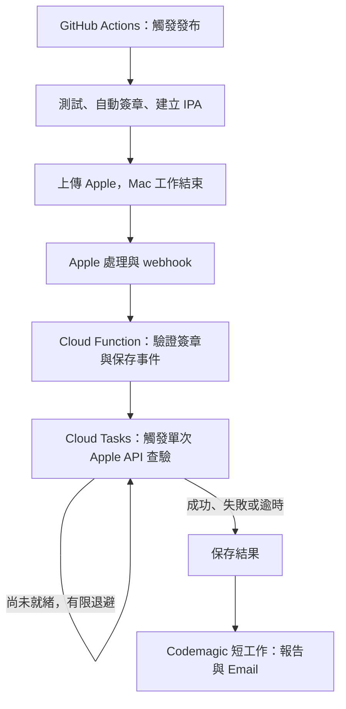

# TestFlight 全自動發布：架構與接手

核對日期：2026-10-03。固定任務：CI-A5／CI-A6／CI-A7；文件整理：CI-A8。這是黃絲帶已部署流程的紀錄，其他公司的帳號、權限與費用需重新核對。

## 已確認規則

- 觸發一次後由程式完成；不依賴 AI 在線、人工刷新或再次登入 Apple。
- 上傳完成與內測可更新是兩個狀態。Mac runner 完成上傳便結束，Apple 處理期間由事件與延遲工作接手。
- 自動簽章必須能取得／建立 certificate 與 provisioning profile；僅自動載入固定資產不等於完成這項要求。
- 每次通知綁定 App、版本、build、App commit 與 release ID。建置失敗、Apple 拒絕及逾時無法確認須分開報告。

## 目前流程與技術

| 元件 | 技術及責任 | 程式位置（已合併的 CI 版本） |
| --- | --- | --- |
| 建置 | GitHub Actions 標準 macOS runner；Flutter、Xcode、Node；自動測試、IPA 與上傳 | `.github/workflows/testflight.yml` |
| 簽章 | App Store Connect API ＋ Codemagic CLI；持久化私鑰，每次取得有效資產、必要時建立 | `tool/release/sign-ios.sh` |
| 完成回報 | GitHub `workflow_run`；獨立 Linux 工作回報取消或失敗，服務再核對 GitHub API | `.github/workflows/testflight-complete.yml` |
| 接收事件 | Google Cloud Functions 第 2 代、Node.js 22；`releaseNotifierFree` 驗證 raw body HMAC | `infra/release-notifier/index.cjs`、`service.cjs` |
| 查驗與排程 | Cloud Tasks 延遲觸發；每次只查一次 Apple API，等待時無常駐 CI runner | `infra/release-notifier/check.cjs`、`apple.cjs` |
| 保存狀態 | Cloud Storage 保存發布、事件、結果與通知狀態；CAS／lease 去重及恢復 | `infra/release-notifier/store.cjs` |
| 通知 | Codemagic `testflight-verify` 讀取已查驗結果、保存報告、Email publisher 寄信 | `codemagic.yaml`、`tool/release/run.cjs` |
| 備援 | Google Monitoring 監控通知服務 ERROR，獨立寄告警，不依賴 Codemagic token | Google Cloud 告警政策 |
| 秘密 | GitHub Secrets、Codemagic secure variables、Google Secret Manager | 僅記名稱與用途，不保存值於文件 |

Codemagic CLI 是建置時使用的工具；主建置實際跑在 GitHub。Codemagic 服務目前只承擔短通知工作，另保留手動發布備援。

Apple webhook 是供應商格式的 HTTP POST；接收程式驗證並對應發布後才執行後續工作。它不是能直接指定為 GitHub `repository_dispatch` 的已授權請求。現行接收服務同時負責保存狀態與查 API，並非單純轉送。

## 成功、失敗與等待

成功須同時核對指定 App／版本／build：`processingState=VALID`、`expired=false`、`internalBuildState=IN_BETA_TESTING`，且指定內測群組包含該 build。Apple upload COMPLETE 事件本身不代表上述條件已滿足。

事件先保存並成功排程才回應。未就緒時以 20 秒至 5 分鐘退避排程，90 分鐘截止；沒有 webhook 時有註冊後 30 分鐘的 watchdog。每次執行結束就釋放運算資源。結果先持久化，再啟動寄信工作；重複事件不應重複發布或覆寫終態。

## 日常使用與维护

在 GitHub Actions 執行 **TestFlight release**，`app_commit` 可指定已核准的完整 40 字元 App SHA；留空使用選定 workflow ref 的 commit。也可推送含新 workflow 的 `testflight/*` tag。不要在不含新 workflow 的舊 App commit 上打 tag，誤走舊發布流程。

最新實跑 build 14 的 App source 為 `c253b85a44131571cdbfdccb97f2ab6fb5306cf6`；CI 架構獨立合併，不代表其他產品分支已合併或驗收。下次發布應選當次核准的 App source，不固定重用此歷史 SHA。

遇到錯誤先依 release ID 查 GitHub 失敗 step、Google release result、Codemagic Publishing；上傳結果不明先查 Apple，勿盲目重傳。更換 key、secret、通知程式或 endpoint 的操作見 [發布操作文件](../release/testflight-cicd.md)。

## 成本與驗收界線

Google 服務仍保留，Functions／Tasks／CI bucket 已移到 `us-central1`，最小實例為 0，發布紀錄保存 90 日。公開 GitHub repository 的標準 runner 與少量 Google 用量按當次核對預估在免費額度內；不保證整個帳戶永久零元，也不能套用到公司的私有 repository。Codemagic 寄信仍占約 38 秒 runner；每天 5 次、每次保守抓 1 分鐘，約 155 分鐘／31 日，重試與其他專案另計。配額與歷史儲存說明以 [CI-A5 驗收](../testing/2026-10-03-ci-free-tier.md) 為準。

- 真實建置：[GitHub run 37102288760](https://github.com/e2755699/yellow_ribbon_study_growing_system/actions/runs/37102288760)，1.0.1（14），上傳完成後 Mac 結束；美國區收到 Apple 真實事件、API 確認內測可用、通知 publisher 成功。
- 簽章：API 真實建立並再次重用 certificate／profile；詳見 [CI-A6／A7](../testing/2026-10-03-ci-autosigning.md)。未撤銷現役憑證來模擬到期，不宣稱所有續期／權限／配額情境都實測。
- 66 項 Node 隔離測試通過；另有真實 GitHub 建置失敗及獨立 Google Monitoring 告警驗收，使用者已確認備援信收到。build 14 正式通知僅確認 publisher 成功，未另取得收件匣確認。

後續架構變更須同步本篇、操作文件、任務及 changelog；可重用原則同步 `automate-release-ci` skill，專案 ID、收件人與秘密不複製到其他公司。
