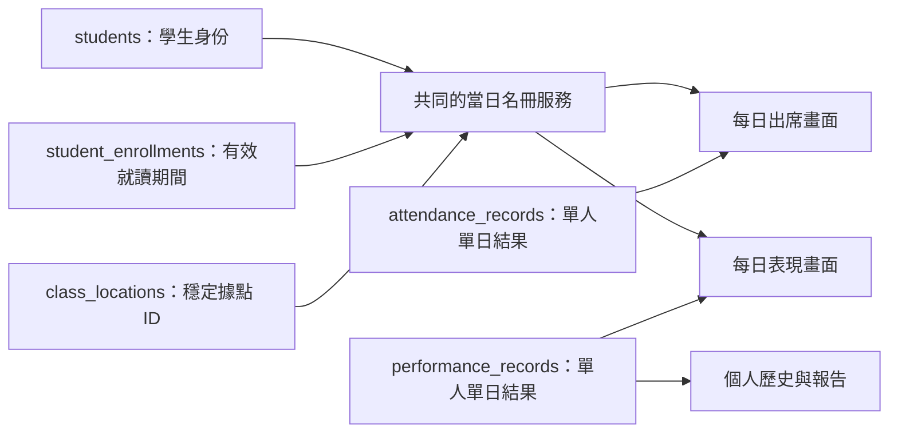

# 學生名冊、每日出席與表現：一致性改造

## ROSTER-A2.1：正式 client transaction 改造（2026-10-03，未發布）

### PR review：簡化 StudentActivityCubit（2026-10-03）

使用者要求移除無實際等待需求的 Completer 與額外清理。load 改為 void、僅啟動訂閱，移除 _ready／_generation；close 保留取消訂閱與 super.close。既有一次讀取 constructor 與畫面行為沿用，重新整理保留舊內容仍未定案。測試改等 State，新增首筆事件前關閉、重載後忽略舊來源已排隊事件兩項回歸。此輪相關測試 9 項、App 全套 197 項通過，變更檔分析零問題；待 PR review／實機驗收，未部署。

需求決定：「需要保留指定據點的限制」、「接受 App 計算，保留整批交易與據點限制」。同一任務內完成 adapter、Rules、整批草稿與回填工具，不再拆成重複任務。以下是本機工作樹結果，取代較早僅做原型／逐位儲存的描述；正式環境尚未切換，rosterCommand 仍在線。

業務規則彙整於 [每日名冊知識庫](../knowledge-base/daily-attendance.md)。使用者 2026-10-03 明確調整流程為「commit → PR → 我 review and 驗收」；本次替代實作提交至同一 PR #8，狀態為待使用者 review／實機驗收，不代表已正式切換。專案流程與範本同步更新，不再以尚未實機驗收阻擋提交。

提交紀錄：067a702 為替代實作，4a35453 為流程更新。同步最新 master 時，唯一文字衝突為 CHANGELOG，保留雙方紀錄；學生生日欄位的 readOnly 修正與本分支就讀欄位同時保留。合併後 App 全套再次 195 項通過，學生詳情合併檔分析 9 個既有 info、零 error／warning。知識庫索引補入每日名冊入口。

| 檔案／範圍 | 最終行為 |
| --- | --- |
| `lib/domain/roster/roster_commands.dart`、`firebase_roster_commands.dart`、`firebase_roster_repository.dart` | 所有名冊 commands 改走 client transaction，先讀後寫；一次 saveRecords 保存所有改動、評分、緞帶、事件及一份 receipt。獎勵由 App 計算，Rules 不宣稱驗證評分與緞帶的完整算式。 |
| `daily_roster_cubit.dart`、`memory_roster_repository.dart`、每日頁面與 Widgetbook | 整批成功／失敗；只改動欄位，後提交覆蓋同欄位；失敗保留全部草稿、禁止離頁。未知結果沿用原 payload／ID；儲存期间新增修改保留，查舊收據不倒退較新訂閱。維護中僅可確認 pending 結果，不啟用新編輯。 |
| `firebase/roster.rules`、`students_repo.dart` | 保留受信任據點／角色授權。用受保護 timeline 作日期投影，未來转點生效後不依賴午夜後端回寫；App 本地日期串流更新名單及逐生訂閱。correctEnrollment 需全部歷史據點，正常轉點／離班只需本次異動據點。 |
| `firebase/roster.indexes.json` | 不查詢的 timeline、membership entries、receipt result 排除自動索引；保留既有查詢索引。 |
| `tool/migrations/roster-client-*` | typed backup、dry-run、maintenance gate、資料漂移檢查、可續跑回填與核對；既有評分、緞帶、歷史與收據不重算、不刪除。 |
| `main.dart`、pubspec／lock、`firebase/roster.deploy.json`、舊 callable entrypoint | 移除 App Cloud Functions 套件／注入，以及本分支的 callable 匯出與部署設定，防止未來重新部署。保留舊 service 供歷史／遷移對照；這不等於雲端函式已刪。 |

寫入數量依文件計：30 筆出席＝30 records＋1 receipt，首次標記課次另加1 session；30 筆首次 excellent＝30 records＋30 wallets＋30 events＋1 receipt。沒有改動不送 command。並非一筆交易就只計一次文件寫入。receipt 有 900 KiB 保守容量檢查；超限整批拒絕，不能暗中拆成多批。

### 本機驗證

- App 全套 **195 項通過**（含 29 個 Cubit、2 個每日頁面 Light/Dark 回饋、23 個 planner 案例）；Web release 編譯成功。Web 的 wasm dry-run 有既有 web 套件相容性警告，實際 JavaScript build 成功。
- `tool/check_design_system.ps1` 通過：Widgetbook **60 項**、產生目錄一致；展示分析零問題；App 視覺範圍 50 個 info、零 error/warning。補跑 domain／repo 分析：6 個 style info、零 error/warning。
- 回填 **9 個純測試＋3 個 Admin Emulator 測試**通過；正式 Rules runner **56／56 通過，零失敗／skip**（原有 7＋每日／就讀 31＋planner 2＋profile 16；planner 案例重放 40 筆實際 Dart 交易並驗滿欄新增）。獨立 Rules review 另 **26 個真 Emulator 案例**通過，修正跨點 wallet、更正 action 偽裝、歷史據點過度限制、migration metadata 相容性及附件分支文字驗證；另驗 profile 收據缺少／重用／錯誤身分與跨點拒絕。
- 使用正式 `DailyRosterView` 與 `DailyRosterPage` 的合成資料 Web 預覽，目視 1024×768、768×1024、1194×834、834×1194、507×768，焦糖主題 Light/Dark：文字換行可讀、重試主操作可到達、未知結果時捨棄按鈕停用。768×1024 實際操作兩生修改→其中一筆不合法→整批失敗／兩份草稿保留→解除故障→重試成功兩筆；成功不彈窗。窄版鍵盤 Tab／Enter 由頁面互動測試驗證。
- 預覽入口：`widgetbook_gallery/lib/roster_preview.dart`；本機驗證使用 `http://127.0.0.1:8004/?case=live` 與 `?case=save-unknown`，均為 Memory adapter，沒有 Firebase 初始化或客戶資料。

Rules 重跑入口：`./firebase/tests/run-client-rules.ps1`，會先重新產生當日 Dart planner trace，再啟動隔離 demo Emulator；詳細契約見 [Rules 測試說明](../../firebase/tests/README-client-rules.md)。最後證據在 Git 忽略的 `.release-private/roster-rules/final-run.log`，測試後 Emulator 已關閉。profile 所有長文字欄位改由同筆新收據驗證，student／receipt 雙向核對身分、operation、actor、timestamp；沒有新增文件寫入，只有單生 profile／enroll 的相依讀取，一般整班儲存不受影響。

### 待實機與正式切換

Windows 無法完成 iOS Pods 重新解析、iPad Keychain 重啟／系統返回、兩台實機登入與跨點權限驗收；未手改 Podfile.lock，不能把 Web／Emulator 當成原生驗收。

| 案例 | 實機操作 | 預期 |
| --- | --- | --- |
| I1 | 兩台 iPad 同據點，分別修改不同學生／不同欄位，再先後儲存 | 訂閱同步且各自修改保留；同欄位以最後成功提交為準。 |
| I2 | 全班修改後，以測試環境撤除其中一筆就讀資格再儲存 | 所有紀錄／緞帶／receipt 都不新增；整批草稿留下，返回被擋。 |
| I3 | 儲存提交後阻斷回覆、關閉重開同帳號 App，再重試 | 同一 operation ID 核對收據，資料只變一次，新的草稿不丟失。 |
| I4 | 限定 A 據點老師操作 B 的学生、歷史更正或兌換；再測合法轉點生效 | 未授權操作拒絕；授權的新據點按生效日期可讀寫，無午夜 Function。 |
| I5 | 中文長備註、多人評分、反覆 excellent／取消評分及兩台同時兌換 | 評分與緞帶原子提交、不重複計獎、兌換不超支，失敗／未知提示明確。 |

正式切換依 [回填與停用流程](2026-10-03-roster-client-cutover.md)：維護／排空→備份回填核對→Rules／新版 App 就緒→只刪 rosterCommand 並獨立確認404→啟用新 client。舊 App 必須升級；releaseNotifier 不在本次改動範圍。尚未執行這些正式操作。

## 儲存錯誤回饋補強（已併入 ROSTER-A2.1，原 ROSTER-A4.1，2026-10-03）

需求原話：「所以錯誤控制要處裡好啊讓老師明確知道遇到錯誤儲存失敗」。本次限每日出席／表現的儲存回饋，不更改衝突勝出規則或 CI/CD。

驗收：明確區分伺服器拒絕與未收到確認；部分成功列出已確認筆數及剩餘學生；失敗／未確認時保留草稿並阻止返回或切日期／據點；重試未確認操作沿用原 ID；只有同欄衝突提供核對覆蓋。全頁用現有 SystemSectionCard 呈現儲存結果，失敗時彈出可讀的結果提醒，成功不彈窗。訂閱更新不可抹掉儲存結果。Widgetbook 加入成功、拒絕、未知結果與部分成功案例，包含窄版 Light／Dark 與鍵盤操作。

狀態：實作與驗證中；尚未發布更新。2026-10-03 接續核對：修正 UI 測試從按鈕外層尋找 Focus 的錯誤，實際以 Tab 導覽至重試按鈕後按 Enter；串流清理移至 tester.runAsync，避免 fake clock 阻擋 close。Light／Dark 2 項 UI 測試通過，App 全套 162 項通過。這些是現有逐位儲存的錯誤回饋驗證，不能當成整批原子儲存已完成；上面的部分成功案例仍是過渡現況，正式目標為整批成功／失敗。

同輪執行 `tool/check_design_system.ps1` 通過：Widgetbook 60 項、App 162 項，Widgetbook 產生檔一致，展示靜態分析無問題；App 指定範圍分析 50 項 info、無 error／warning。尚未重跑真實畫面與 iPad 實機，因此不宣稱視覺／實機驗收完成，也未 commit、push 或部署。

## PR 範圍整理（2026-10-03）

`codex/roster-migration` 從最新 `origin/master` 建立，採用已發布產品與切換文件快照 `c2d3f51`，獨立提交名冊／Firebase 改造。App、後端、遷移工具、測試與 Widgetbook 內容逐路徑比對快照一致。`codemagic.yaml` 與 master 相同；排除早期 `tool/testflight_release.py`、後續 CI webhook／通知服務、CI 文件與 `tool/release/`。原分支上的 CI 工作繼續保留，未重設或重寫其歷史。

本次整理重新執行 4 項純遷移與 3 項後端 policy 測試，7 項通過；`git diff --check` 通過。新工作樹未安裝後端依賴的第一次 policy 測試因缺模組失敗，使用原工作樹相同 lockfile 的既有依賴重跑後通過。既有 App 153／Widgetbook 57、Emulator／Rules 與視覺結果沿用下方已發布快照證據，未在本次整理重跑完整 Flutter 或實機驗收。下方早期提及的 CI 嘗試為歷史紀錄，不代表本 PR 包含其工具。

## 發布完成（2026-10-03 00:19）

1.0.1 (11) 已在 App Store Connect 的 yellowribbon 內部群組顯示「正在測試」，且已有此版本安裝紀錄。Apple 上傳 00:13:45 無錯誤；建置 ID 6abfd53efead61ed21b4bc28，來源 a3960c4。既有群組為自動分發；CI 重複指定群組產生的錯誤不代表實際分發失敗，已直接核對 Apple 狀態。詳見 docs/release/testflight-20261003.md。

正式備份、授權的測試資料清理、新模型切換、逐筆對帳與索引查詢已完成。App models 解析 30 份客戶學生及 267 筆歷史紀錄成功，10/2 和 10/3 名冊均為 30。既有測試人員安裝紀錄不等於實機功能驗收；兩裝置、Keychain 重啟、附件端到端仍未驗證。下方「待上傳／尚未切換」為過程紀錄，不代表最新狀態。

## 正式切換結果（2026-10-03 00:00）

- 使用者要求發布與資料清理同步；清理後來源 73 文件再次演練完成，633 項預定寫入／核對通過，0 警告／衝突。
- 正式 roster.rules 已部署，雲端 ruleset 為 1b800207-d416-44df-9540-de9134f3c794。讀回內容與本地候選完全一致；Firebase Rules API 對實際已發布規則執行 5 個舊集合／學生直接建立拒絕案例與 1 個正常 config 讀取案例，全部 SUCCESS。這是服務端規則評估，不是真實 iPad 登入測試。
- 原有 4 個已啟用 Firebase Auth 身分沿用原先兩據點完整編輯能力，建立受信任 staff_access；IAM owner 對應 owner，其餘 manager。未依自填 users.role 授權，未增加帳號、IAM 權限或新的存取範圍。
- 屏障建立後重新匯出，既有 73 文件與演練來源完全相同；正式 apply 633、verify 633 通過。只在學生主檔合併關聯 metadata，原客戶欄位、9 舊出席、2 舊表現、29 緞帶皆保留。新集合保留原始歷史來源，不回算舊獎勵。
- app_config/roster 已啟用，查詢核對永康 30、北區 0。既有入班日沒有可信來源，2026-10-02 僅作未知日期基線，startKnown=false；不得宣稱客戶真正入班日就是基線。新建立學生仍必填實際入班日。
- 切換證據另存 C:/WorkSpace/yellow_ribbon_backups/2026-10-02-roster-cutover，包含 frozen backup、plan、apply、verify、rules-verification、enabled。舊 App 的學生／日紀錄／緞帶寫入已封鎖，必須更新新版。
- 以現有專案 owner 憑證嘗試短期 Firebase client 驗證時，IAM signBlob 被拒絕；未擴張 IAM 權限、未改密碼、未保存 token。真實登入／兩裝置／Keychain 重啟驗證仍未完成。
- 1.0.1 (11) 首次重建 6abfd3a67394575b200a7b54：雲端測試成功；pod install 下載既有 FirebaseFirestoreGRPCBoringSSLBinary 的 GitHub openssl.zip 回 504，未產出 IPA，已重試同一 commit a3960c4。TestFlight 尚不可宣稱發布成功。

## 最新執行狀態（2026-10-02 23:49）

- 使用者明確要求先備份、刪除客戶 10/1 開始輸入前的測試資料，並要求 TestFlight 同步進行。清理已完成，不再適用下方較早「正式資料未更動」描述。
- 備份已保存在工作樹外 C:/WorkSpace/yellow_ribbon_backups/2026-10-02-before-test-data-cleanup，包含 352 份 Firestore 文件、10 個 Storage 附件、雜湊及完整清單。PII 僅在私有本機備份，未加入 Git。
- 依伺服器 createTime 和学生 ID 關聯清理：保留 30 位客戶學生；刪除 33 測試學生、128 出席、101 表現、17 緞帶文件及 10 附件。先 Emulator 演練，再單一交易核對 352 文件的 data/updateTime，最後比對 73 份保留文件完全一致。未刪帳號、據點或客戶較早邏輯日期的歷史紀錄。
- 清理後重新完整唯讀匯出：73 文件，30 學生、9 出席、2 表現、29 緞帶、2 據點、1 users。重新產生遷移計畫：0 conflicts、0 warnings；不得使用先前含 33 測試學生的舊計畫。
- 8 個正式索引全部 READY；實際 enrollment / attendance / performance / session 查詢通過。
- 新資料模型切換尚未執行，Rules/staff_access/app_config 尚未上線；須保留客戶資料並核對後才能啟用新版。Codemagic build 6abfc4af7394575b200a76af 的 1.0.0 (10) archive/測試成功，Apple upload 尚未回報成功，不可聲稱客戶可更新。

> Working doc。2026-10-02：隔離分支已實作名冊、生命週期、草稿、歷史統計與後端交易，目前進行整合驗證；尚未部署後端、遷移正式資料或發布 TestFlight。
> 目標：新增、轉點、離班及多人操作後，名冊、出席、表現、歷史與獎勵仍可對帳。

### 實作進度（接續優先讀此段）

- 正式備份副本的本機 Emulator 全量演練已通過：14,362 個目的文件逐項驗證，63 位學生（北區 33、永康 30）、原始歷史與 46 份緞帶統計一致。正式資料仍未切換。
- CI 免互動核對嘗試：YAML inspection job 6abfccc37394575b200a7929 在啟動前回報 `App Store Connect integration "Jackalope" does not exist`。既有 Workflow Editor 個人帳號 key 可簽章，但不能假設可直接用同名 YAML integration。已移除此次新增的未接通 YAML 工作；tool/testflight_release.py 僅為尚未連線驗證的工具，不能當完成證據。需沿用 Workflow Editor；主建置 6abfc4af7394575b200a76af 不受影響。
- **最新使用者約束**：使用者強調客戶已輸入正式資料，不得弄壞。已停止正式資料切換；未部署新 Rules、未寫 staff_access/app_config、未執行 apply、未更動學生或既有出席／表現／緞帶。已完成的正式操作只有新增兩個 Functions（rosterCommand、applyDueMemberships）及索引；唯讀全量備份留在 .release-private。後續不得把未完成切換的 build 通知為可供客戶使用。
- 發布實況：fec7817 已 push；Codemagic build 6abfc4af7394575b200a76af 的 1.0.0 (10) 已通過雲端測試、原生 archive/IPA 及既有合成資料 iPad 截圖測試，進入 Publishing。正在以既有 Jackalope CI 整合核對 Apple 狀態，避免再要求使用者登入。
- 唯讀備份共 352 份文件：63 學生、137 舊出席、103 舊表現、46 緞帶、2 據點、1 users 文件；Auth 4 帳號且無 custom claims。歷史衝突来自 2025-01-22、2025-03-13 的兩種日期格式：3 筆出席／缺席相反，另 1 筆只有空字串與 null 差異。新生並非原因。7970b1f 補了遷移工具隔離矛盾欄位、保留兩份原始證據的測試；**未套用正式資料**。
- Admin SDK 14 需 modular API，已修正部署入口並增加入口 smoke test；兩 Functions 已成功建立，CLI 最後因 artifact cleanup policy 未設定回傳非零，不能誤記為函式失敗。未刪除舊 artifacts。Rules 7、migration 3、pure migration 4 項通過。新索引實際查詢發現多 inequality 自動排序需要 endDateExclusive→startDate，已補索引但仍待再核對 ready。
- 發布優先更新：使用者再次要求立即發布。Firebase CLI 的 e2755699@gmail.com 已登入且確認有 test-o9g27r 權限，Codemagic 亦已登入；不再要求重複授權。沿用現有 Workflow Editor、Flutter 3.47.5、Jackalope 自動 App Store 簽章與上傳設定，準備 1.0.0 (10)。依使用者授權先提交隔離分支啟動雲端 iOS 建置，原生驗收與後端就緒仍須在通知客戶可更新前完成；不把本機測試當作發布成功。以下較早的等待登入紀錄已失效。
- 最新待釐清：使用者詢問是否已「搬到新的地方」。目前實作仍注入 FirebaseRosterRepository 並指向 test-o9g27r；本次未切換後端或正式搬資料。停止 Firebase 部署／資料操作，先確認使用者所指的新目的地。Firebase CLI 剛回報已加入正確帳號，無需再次要求登入；此登入成功不代表後端目標已確認。
- 新版每日出席／表現路由已共用名冊服務；個人歷史與成長報告改為月份查詢，完整結果保存在 Cubit State。Repo 有帳號／權限／據點／日期隔離的共用訂閱快取，inactive LRU 上限 32；iOS 草稿用 Keychain，Web 僅工作階段並顯示限制。
- 新生必填真實入班日；轉點／封存／復學／歷史期間核對走可信任交易。未點名、未評分保持空值；只有已確認欄位與有效期間列入統計。課次另有明確確認及取消；未確認舊日不假算出席率。
- 最終 `tool/check_design_system.ps1` exit 0：App 153 項、Widgetbook 57 項通過（含異動模式驗證回歸與 Light/Dark 離線預覽）。Node 22 Emulator 14 項交易＋2 項實際遷移工具測試、Firestore Rules 7 項通過。不得把以上自動測試當作實機驗收。
- 新增 migration export / apply / verify 工具；只允許私有目錄輸出；apply 必須驗證 maintenance 與已封鎖舊版寫入，且備份來源與計畫雜湊一致。學生主檔採 metadata merge，舊出席／表現與緞帶原集合保留，禁止覆寫不同的新集合目的資料。Emulator 已驗證完整匯出、型別保留、重跑、來源變動拒絕與金額不變；正式完整盤點仍待登入。
- Apple 已核對目前最新 TestFlight 為 1.0.0 (9)，現有內部群組 yellowribbon；下一建置號須重新核對後使用至少 10。Firebase CLI 已重新建立過期登入，停在管理 Firebase／Google Cloud 的「允許」畫面；Codemagic 停在 GitHub 登入。兩者均等待使用者完成；尚未建置 iOS。
- 介面沿用 SystemPage / SystemPageHeader / SystemPageInfoBar / SystemSectionCard；全頁儲存維持頁首，单筆確認／衝突處理靠近卡片。雙欄需要可用寬度至少 900（每卡至少約 420px），窄版單欄換行，尺寸為結構 breakpoint，顏色／字級／間距走 SystemTheme。

- 使用者已授權依 skill 持續做到 TestFlight 可供客戶更新；採最新 master 的隔離分支 `codex/student-roster-integrity`，工作目錄 `C:/Users/USER/.codex/worktrees/student-roster-integrity/yellow_ribbon_study_growing_system`。原始工作目錄未改動。
- A1 核心程式與自動回歸已實作：四個探針已轉為正式測試且全部通過；另測歷史僅儲存改動、失敗保留、ACK 不清新草稿、相同請求合併，以及三方欄位合併／衝突。舊集合過渡期採交易合併、表現及緞帶同交易，編輯時沒有緞帶寫入，出席讀取不再建立文件。未發布。
- A1 的整合／畫面驗證與其餘功能一起在發布前完成；目前不 commit、不標整個 A1 驗收完成。這是依使用者完整交付授權調整 task 閘門順序，不能拿單元測試代替最終 UI 與 Emulator 驗證。
- Apple 已確認登入且可見既有 App；Firebase CLI 正在等待使用者用可管理正式專案的帳號完成登入，本機工作繼續。
- 已確認的分層：Repo 執行查詢／訂閱及共用快取，Service 定義名冊與統計規則，Cubit State 保存完整結果／篩選／草稿，UI 只顯示及傳遞操作。搜尋只影響 visibleRows，不能改統計分母。Repo 快取按帳號／權限／據點／日期隔離，容量有限；未儲存草稿獨立儲存。
- 統計分母的具體來源補齊為 `class_sessions`：日期／據點的上課狀態由老師明確登記；第一次明確點名可同交易確認該日有上課，單純查看不建立。舊日文件可能由開頁自動建立，所以不能一律當已上課。取消上課保留歷史審計，該課次不列分母；未知舊日期顯示資料不足。這是出席率正確所需的最小課次確認，不引入排課或結日制度。

## 接續備忘

- **設計決策**：以學生 ID 關聯資料；有生效日期的就讀關係決定每日名冊；出席、表現各存每位學生的單日紀錄。不可再把首次開頁的人員陣列當永久名冊。
- **下次先做**：確認 Firebase CLI 與 Codemagic 登入是否完成；取得正式唯讀盤點、可信任工作人員清冊及現行 Rules／索引。完成剩餘 staging／原生手動驗證後，依 `tool/migrations/README.md` 進行切換與 TestFlight。勿重新實作已完成的 A1–A6 核心程式。
- **基線**：目前工作目錄 `feat/performance-card-fullscreen`，HEAD `4bdef91`；查核時遠端 master 為 `d2787c5d276633584d629cebd7d3e259a294a9a9`。master 已有新版出席元件；實作應從最新 master 隔離分支開始，保留本機既有未提交工作。
- **正式環境限制**：Chrome 已讀取 `test-o9g27r`；目前 Firebase CLI 帳號列出的專案不含此專案。完整匯出、遷移與部署須先取得正確帳號的既有授權，不能拿其他專案代替。
- **今天就能做**：A1–A6 的本機程式、合成資料、Emulator 與 Widgetbook 工作。A7 正式盤點及切換需正確專案權限與維護窗口。
- **已有產物**：四個探針已成為正常通過的回歸測試；新契約、交易服務、遷移 CLI、共同名冊／歷史頁與 Widgetbook 均在隔離工作目錄。尚未 commit／push／建立 PR。
- **後續發布授權**：使用者已要求完成修正後直接發布 TestFlight，由使用者通知客戶更新。沿用現有 App `6746115397`／Bundle ID `yellowribbon.studygrowingsystem.app`；發布成功須核對 Apple 處理完成與客戶所屬測試群組可取得版本，不能把 IPA 上傳成功當成客戶已可更新。本次先開啟 App Store Connect 供使用者登入；尚未啟動建置或發布。既有 Codemagic Workflow Editor 的實際設定須重新核對，不能假設根目錄 YAML 已啟用；亦須核對目前 Flutter 3.47.5 與簽章狀態。此次授權是 TestFlight，不包含正式 App Store 送審或代替使用者通知客戶。

## 需求原話

> 客戶開始新增學生了，但是他發現新增的學生人數在每日出席的學生數量不對
> 少掉的學生有哪些原因是甚麼
> aa每日出席的學生應該是要用關聯的方式去學生資料吧
> 你有檢查firestore和城市嗎?
> 想一下這個要怎麼改設計我懶得思考= =要想的完善一點並且要做全面檢查

## 查核範圍與證據

### Firestore 實際資料

只讀取，沒有更動客戶資料。文件中的學生數字為彙總；不複製學生個資到版本庫。

| 實際查核 | 結果 | 能得出的結論 |
| --- | --- | --- |
| `students` 文件清單 | 58 位；與兩據點 10/1 出席 ID 比對，缺少 13 位 | 当前學生名單與已存出席名單不同；單獨這點不能證明歷史就讀日期 |
| 13 位缺少學生的個別文件 | 其 `classLocation` 全部是精確字串 `台南永康區` | 這 13 位不是因城市字串不同而被排除 |
| `daily_attendance/2026-10-01_台南永康區` | 12 位 | 該出席文件只保存 12 位 |
| `daily_performances/2026-10-01_台南永康區` | 25 位，包含上述 12 位及缺少的 13 位 | **同一天、同一據點，兩功能名單已直接矛盾** |
| 10/1 台南北區出席文件 | 33 位 | 目前兩份出席名單合計 45 位；與 58 位差 13 位 |
| `class_locations` | 2 筆：`Iw1PMgsLV1sDutnVFKxt`＝台南北區；`n7GTeqclV33bHhOvGV0f`＝台南永康區 | 可採這些既有文件 ID 作穩定據點識別 |
| 本機 `ClassLocation` | 台南永康區、台南內門、台南北區共 3 個；`.name` 自訂為中文 | 本機選單與線上據點清單不同；不可拿 enum 符號取代實際中文舊 ID |
| 歷史文件 ID | 可见緊縮日期及連字號日期兩種格式 | 遷移須偵測同一天是否存在重複資料；本次未斷言重複內容已碰撞 |
| 線上已發布 Rules | 有電子郵件的登入帳號可讀寫所有文件 | 權限問題是線上實況，須納入切換前必要修正 |

表現文件的 `date` 值不是可靠的伺服器建立時間，不能据此認定某學生何時入班或當日真的出席。13 位的名字已在先前調查回覆列出；本文件保留彙總與可重做的比對方法。

### 程式追查與差異清單

| ID | 差異、影響與判讀 | 主要來源 |
| --- | --- | --- |
| D1 | 既有出席文件直接回傳快照，只有不存在才讀學生名冊；開頁還會寫入預設出席文件。新生無法進入已建立日期。 | `lib/domain/repo/daily_attendance_repo.dart` 的 `load`、`save` |
| D2 | 表現也獨立保存名單；單人 `saveRecord` 可建立只有一人的日文件，之後班級頁沿用不完整名單。 | `lib/domain/repo/daily_performance_repo.dart` |
| D3 | 出席及表現整份陣列覆寫，無交易或版本檢查；兩位老師操作不同學生也可能互相覆蓋。 | 上述兩個 Repository |
| D4 | 無修改離頁仍儲存整份資料；舊畫面可以覆蓋別人剛儲存的內容。 | 兩個 Daily Cubit 的 `saveBeforeExit`、`YbLayout` |
| D5 | 新列預設缺席，表現預設 average／各科 3 分；未操作與已評量無法區分。未知枚舉可能使整份解析失敗。 | `student_daily_attendance_info.dart`、`student_daily_performance_info.dart` |
| D6 | 個人歷史表現用 SID 找列，同一學生不同日期共用 SID，更新第二天可能取代第一天。淺拷貝的可變 Notifier 也使取消無法還原。 | `lib/domain/bloc/student_performance_cubit/student_performance_cubit.dart` |
| D7 | 表現變更未儲存就調整緞帶；計數採先讀後寫，撤回獎勵與兌換混用；讀取計數失敗可能被當成 0。 | `student_performance_main_section.dart`、`yellow_ribbon_repo.dart` |
| D8 | 學生無入班／離班生效日期；刪除學生為 hard delete，歷史紀錄仍在；名字及據點異動沒有歷史關係可判定。 | `student_detail.dart`、`students_repo.dart`、`student_cubit.dart` |
| D9 | 業務 Repository 主要一次 `.get()`，無持續訂閱；個人歷史掃整個表現集合。頁面與 Cubit 的擁有權不一致，直接加 listener 會有生命週期風險。 | `lib/domain/repo/`、個人表現／歷史／活動頁 |
| D10 | 中文據點字串同時當識別；本機 enum 與線上資料不一致，未知值不能默認第一個據點。 | `class_location.dart`、`class_locations` |
| D11 | 線上 Rules 與 `firebase/firestore.rules` 不同；本機有舊集合而缺現行集合，不能直接整份發布。 | 線上已發布規則、本機 Rules |
| D12 | 部分讀取失敗與查無資料混用；報表以目前名單及預設成績推導歷史會錯；舊日期格式、舊布林欄位及未知值需保留。 | `students_repo.dart`、序列化、歷史／成長報告路徑 |

`QueryPageWidget` 使用舊 `student_profiles`，目前未掛在主要導覽；沒有證據顯示它造成這次少 13 位，不把它算作本次根因。附件儲存、取消回滾與既有導覽行為須保留。

## 推薦的產品規則

| 情境 | 明確行為 |
| --- | --- |
| 新增學生 | 必填據點與入班日期，預設台灣今日。建立完成後，生效日期起的出席與表現同步看到學生，無須重建日文件。 |
| 看以前日期 | 以當天有效的就讀關係顯示；今天新增學生不自動出現在入班前。老師確認實際較早入班時才回填。 |
| 沒有當日紀錄 | 出席顯示「未點名」、表現顯示「未評分」；不寫預設缺席或 3 分。 |
| 轉點 | 指定生效日 D：原據點到 D 前一天，新據點自 D 起；在同一交易更新，不存在同日兩個有效據點。 |
| 離班／停用 | 指定第一個不在班的日期；封存學生，保留先前歷史。重新入班新增就讀期間。 |
| 改名字、據點名稱 | 透過穩定 ID 關聯；主要顯示目前名稱，必要時顯示紀錄當時名稱，不能因此產生第二個學生。 |
| 老師正在編輯時有新生 | 即時加入未點名列，不覆蓋既有草稿；排序穩定，不讓焦點跳到別人。 |
| 正在編輯者被轉點／封存 | 保留草稿並標示資格變更，禁止把舊畫面直接存到新的據點。可取消或走有理由的歷史更正。 |
| 搜尋、篩選 | 班級總數以完整當日名冊計算，另外顯示搜尋結果筆數；不能把結果數冒充應到人數。 |
| 權限／網路／解析錯誤 | 明確顯示錯誤、快取或資料異常；不能顯示「0 人」並覆寫。 |
| 無課日期 | 不因日曆日期存在就計為缺席。這次不引入課表排程或結日制度；出席率須有可靠應上課次數才計算。 |

出席既有狀態 attend、late、earlyLeave、absent、leave、busAbsent 保留。到席統計維持 attend＋late＋earlyLeave；缺席、請假、未搭車分別列出，不改寫原本語意。增加「應列名冊、已點名、未點名」三個數字。歷史名冊不完整時標明，不發布假精確的應到率。

使用者再次確認的必要驗收：今天實際入班的學生，出席率只從今天起的實際應出席課次計算，入班前不列分母也不算缺席；補建檔仍依實際入班日期。須先確認實際上課／應出席課次來源，不能以舊日文件存在或日曆天數推定。有未確認點名時只顯示暫算值與完整度，例如應到 12 次、確認 10 次、出席 8 次顯示「暫算 80%，已確認 10／12 次」，不能當最終出席率；分母不可確認或零筆資料顯示資料不足。納入 A2/A5 的資料契約及 T02/T16/T26 驗收。

## 資料與狀態設計

### 唯一資料來源與鍵值

| 資料 | 欄位及約束 |
| --- | --- |
| `students/{sid}` | 個人主檔、封存狀態、`createdAt`、`updatedAt`、`revision`。學生 ID 永不因改名改點而換掉；既有 ID 原封保留。建立時間不等於入班日期。 |
| `class_locations/{locationId}` | 沿用現有文件 ID，`name/order/active`。動態據點目錄，移除 enum 作資料主鍵。台南內門須列入異常對照，不擅自歸入別點或新增正式據點。 |
| `student_enrollments/{enrollmentId}` | `studentId/locationId/startDate/endDateExclusive/revision/source`。開始含當日、結束不含當日；未結束使用明確最大日期以利查詢。單一學生期間不可重疊。另標示起始時間是否已確認，不能把遷移日期當真實入班日。 |
| `attendance_records/{recordId}` | `studentId/locationId/dateKey/enrollmentId/status/leaveReason`，加共用審計欄位。唯一鍵為日期＋據點 ID＋學生 ID；固定編碼並驗證，不可直接拼任意名稱。 |
| `performance_records/{recordId}` | 同一組身份鍵；整體與各科評量可為 null、備註、品格標籤、獎勵關聯。不同日期不能只以 SID 找列。 |
| 共用紀錄欄位 | `schemaVersion/revision/updatedAt/updatedBy/lastOperationId`，歷史必要的最小名稱快照、遷移來源及可信度。伺服器決定時間與操作者。 |
| `record_operations/{operationId}` | 伺服器維護的操作憑證，綁定操作者、目標、基準與內容雜湊，用於重試去重與追查。重複 ID 但不同內容必須拒絕。 |
| `ribbon_events/{eventId}` | 不可由一般客戶端改寫的獎勵／撤回／兌換流水，連結表現紀錄及 operationId；計數為可對帳彙總。 |

名冊組合：當日有效就讀關係 JOIN 學生，以 SID 對應，再 LEFT JOIN 出席／表現結果。缺結果仍有列。既存結果找不到有效關係時放「歷史資料待核對」，保留原紀錄、來源與計數，不能默默丟掉或混入正常分母。查不到個人主檔時用明確的歷史快照，不產生假的現役學生。

Firestore 不會替 App 執行 SQL JOIN；由共同 Repository 組合範圍受限的資料流。依據點＋日期查結果、依據點＋生效區間查就讀關係；學生摘要集中快取與批次查詢，不能每個畫面再開 58 組重複訂閱。歷史頁用學生 ID、允許據點、日期排序與分頁，不掃全部集合。學生已轉點時，僅按目前据點訂閱個資會漏掉歷史學生，須依授權取得必要摘要或使用歷史快照。

複合索引隨版本提交：就讀關係 `locationId/startDate/endDateExclusive`；紀錄日頁 `locationId/dateKey`；歷史 `studentId/locationId/dateKey`。實際索引方向依查詢及 Emulator／staging 驗證決定，缺少區間欄位的旧資料須先處理，不能任由查詢排除。多區間查詢與成本參考 [Firestore 官方文件](https://firebase.google.com/docs/firestore/query-data/multiple-range-fields)。

### 儲存、多人衝突與離線

1. 模型改不可變 DTO；`remoteBase`、`draftPatch`、`baseRevision` 分開。Notifier 留在視覺層；取消只丟棄草稿，恢復最新已存資料。
2. 只提交修改過的列／欄位；無修改儲存及離頁是 no-op。切日期或據點沿用既有儲存流程，失敗留在原頁且保留草稿；返回保留儲存／捨棄／取消行為。
3. 以交易讀取目前列，比對草稿所修改欄位的舊值。未碰欄位合併；同欄位已由他人改成不同值則提示衝突，不做最後寫入者覆蓋。出席狀態＋請假原因是一組語意單位。
4. operationId 在一次邏輯儲存開始前固定。結果未知時用同 ID 重試；不可每次網路 retry 都新增獎勵。單列提交序列化，儲存 ACK 只清除該次送出的草稿版本，不清掉等待時又輸入的內容。
5. 多人整班儲存採每列結果回報；例如成功 8 筆、失敗 2 筆，就保留 2 筆待處理。不能顯示全數完成，也不能重送已成功列造成重複獎勵。
6. 正式提交須連線完成交易。離線顯示「尚未送出」；加入按帳號隔離的本機草稿儲存抽象，僅保存必要 patch、基準、operationId，不存完整學生個資。iPad 持久層採受平台保護的加密儲存；Web 若沒有等效受保護儲存，只提供當前工作階段草稿並明示關頁限制。不可把一般 localStorage 當安全草稿庫。強制登出立即清除畫面與權限，恢復連線／登入也不自動提交舊帳號草稿。
7. 日期是 `Asia/Taipei` 的業務日期，不依裝置時區截取 UTC。跨午夜不移動已編輯資料；未來日期不開放記錄實際出席／表現。入班及轉點可預先指定未來生效日。

交易可能重跑回呼且離線失敗，回呼不可產生 UI 副作用；原子寫入與失敗語意依 [Firestore transactions](https://firebase.google.com/docs/firestore/manage-data/transactions)。若使用 callable 處理寫入，後端也必須使用交易；網路回應遺失仍以 operationId 查明結果。

### 訂閱與生命週期

- 每個路由明確擁有 Cubit 與 subscriptions。日期／據點／帳號切換取消舊訂閱並增加 generation，過期結果不能蓋新畫面；dispose 關閉全部 listener。
- 名冊及結果都載入才宣告完整 ready；初始快取、伺服器已確認、錯誤分開。解析錯誤保留異常數與提示，不把壞列當不存在。
- UI 以完整 recordId 作 `ValueKey`，全螢幕卡片與清單共享同一份草稿狀態。修改中的遠端事件依三方合併規則處理，不整個重建可編輯控制器。
- 個人資料解析集中；notFound、permissionDenied、networkError、malformed 不能同回傳空學生。
- 元件只接 DTO／callback，不直接建立 Firebase Repository、訂阅或 GetIt。獎勵數由上層 service adapter 注入。

快取首筆、listener error 與取消方式依 [Firestore 即時監聽文件](https://firebase.google.com/docs/firestore/query-data/listen)。

### 表現與緞帶

- 保留現有「整體 excellent」的獎勵觸發規則，不擅自把各科分數也變成獎勵條件。
- 編輯及取消完全沒有獎勵寫入。成功儲存表現、獎勵事件與總額在同一伺服器交易完成；修改其他欄位或重試不重复發獎。
- 撤回與兌換是不同事件。已兌換後更正表現仍允許；不足額記為待抵扣差額，顯示可用額最低 0，後續新獎勵先抵扣，不把撤回假裝成一次兌換。
- 舊總數作遷移期初值，不重新播放所有歷史 excellent，否則會重複發獎。舊列沒有可靠獎勵關聯時標 `legacyUnknown`，不自動補發／扣除，保留待核對提示；有確認證據才由授權者登記調整。
- 讀取計數失敗顯示錯誤，禁止「預設 0 再寫回」。單純查看不存在的計數也不新增文件。

### 權限與可信任寫入

線上廣域規則允許 `request.auth != null && request.auth.token.email != null` 讀寫全部資料；另一條 2024-12-31 到期規則不會取消它。重疊 match 任一 allow 成立即可通過，所以新增限制不能抵消舊廣域規則，見 [Rules 結構文件](https://firebase.google.com/docs/firestore/security/rules-structure)。

- 採受伺服器管理的 `staff_access/{uid}` 作老師／管理者及可操作據點來源；不能信任使用者可自行改寫的 `users.role`。既有管理者須用可信任身分清冊開通，不能批次把現有 role 全當真。
- 每日紀錄、轉點／封存與獎勵提交走可信任服務；老師只能寫授權據點與有效關係，歷史資格例外更正須管理者、理由及審計。
- 就讀期間以每學生一個 revision guard 序列化異動，交易驗證期間不重疊；一般 client 不直接寫關係文件。學生建立與初始關係須原子完成；附件流程保留既有上傳回滾處理。
- 後端驗證日期、身分鍵不可變、狀態／分數／文字長度、revision、operationId 與操作者。Admin SDK 繞過 Rules，服務自己必須做授權。
- 客戶端讀取 Rules 與查詢條件一起設計；先枚舉現行集合（含主題、附件相關權限及舊頁必要資料），逐項驗證，再移除廣域 allow。不能直接用不相符的本機規則覆蓋線上。
- 日誌及錯誤訊息不輸出整份學生個資；稽核存操作者、目標、變更欄位及必要前後值。角色／據點撤權要使訂閱失效並清除可見資料。

Rules 不是查詢後的資料過濾器，詳見 [官方查詢與規則文件](https://firebase.google.com/docs/firestore/security/rules-query)。

## 舊資料與切換策略

1. **完整唯讀盤點**：匯出 students、據點、全部出席／表現／緞帶文件、線上 Rules、索引與使用中版本；備份原始內容及雜湊。列出同日重複 ID、無主學生、跨據點衝突、未知狀態、舊欄位與缺欄位，產生 dry-run 報告。
2. **當前關係基線**：以切換日 C 已確認的現役學生建立自 C 起的已知有效關係；另標註實際入班日期未知。不得用建立時間推定入班，不把目前名冊灌進全部舊日期。
3. **歷史名冊證據**：已存出席／表現的同日 SID 聯集是歷史名冊候選來源。10/1 永康有 25 位同日證據，可呈現 12 筆舊出席及 13 位待核對／未點名；標記名冊來源與完整度，**不能替這 13 位補缺席或到席**。確認真實入班期間後才轉為正常歷史關係，不從零星紀錄插值推定整段期間。
4. **保留舊值與來源**：原有 absent、average、3 分無法區分自動預設或人工輸入，先原值遷移並標 `legacyUnverified`；不能全算真實評量，也不能全數清空。舊布林欄位、未知品格值保留原始 payload 供核對，不能靜默捨棄。
5. **衝突處理**：同一新鍵的重複舊資料內容相同可去重並記來源；不同值隔離，阻擋對應紀錄自動遷移，不能用文件排序決定勝者。無主紀錄保留歷史快照，不假建現役學生。每筆遷移以來源鍵及版本去重，可重跑。
6. **相容版本先行**：先發布懂維護模式與新契約的 App。新 schema、索引、服務與 Rules 在 staging 驗證；短期 shadow read 比較新舊結果，但不開兩套並行寫入。
7. **正式寫入屏障**：維護窗口暫停舊集合寫入，確認服務端拒絕舊客戶端寫入；再做最終備份、增量遷移、逐集合筆數／鍵／值／金額核對，切新客戶端寫入。版本提示只是體驗，真正屏障必須在服務端。
8. **驗證與回復**：切換前可撤回至未改動的舊資料；一旦新系統已有寫入，禁止直接還原舊快照。出錯先停寫、保留新操作流水，再修復前進或經核對的反向遷移，避免二次遺失。

歷史例外是否可修正、哪些人有管理權是正式遷移須由資料負責者核實的事實，不是把設計選擇丟回使用者。本機與測試環境可先完成全部實作。

## 畫面與設計系統

採用 `yellow-ribbon-ipad-ui` 的觸控與視覺驗證要求，維持目前導覽、列表→詳細→編輯→返回流程，不另做一套風格。

- 沿用最新 master 的 `AttendanceRecordCard`、`AttendanceSummaryBar`、`SystemPageHeader`、`SystemPageInfoBar`，增加未點名、快取、待儲存、衝突及異常狀態；每日表現與個人歷史共用可注入資料的正式表現元件。
- 以 `SystemTheme.of(context)`、`SystemPage`、`SystemSectionCard` 及既有卡片樣式統一；語意狀態不用只有顏色表達，禁用動作要看得出不能操作。狀態鍵與主題 ID 不寫封閉白名單。
- 學生新增／編輯加入入班日期；據點異動改為有生效日的轉點動作，刪除改封存並保留歷史。44 pt 最小觸控區，鍵盤出現與 Split View 不遮擋儲存／錯誤訊息。
- 所有變更的公開元件同步登記 `docs/design-system-components.json` 與 `widgetbook_gallery/lib/usecases/`，Widgetbook 用合成資料與 memory theme repo，確實引用 App 同一個 class。
- 正式元件包含 ready/loading/empty/error/disabled/long-content，加上未點名、未評分、草稿、衝突、部分成功與無主歷史案例。Light/Dark、觸控與鍵盤都驗證。
- 本次只規劃受影響名冊／日紀錄／歷史／緞帶元件；首頁、未使用 query 等其他 legacy 畫面不藉此整個重做。

## Task list

以下保留原驗收範圍；A1–A6 核心已實作，依下列狀態區分本機證據與未完成的正式／原生驗收。依賴：A1 可先修；A2 → A3/A4；A3＋A4 → A5/A6；A1–A6 → A7。正式切換前完整依賴必須完成。

### A1 — 先封住現有破壞性寫入
- Status：程式與回歸通過；整合原生手動驗證待完成；Depends on：最新 master 的隔離工作分支；複雜度 M。
- 做什麼：個人表現用完整日期／據點／SID 識別，深層不可變草稿；沒有修改不寫入；在舊模型過渡期用交易更新變更列，失敗保留草稿。未儲存的緞帶 side effect 先移到受控成功儲存流程，不擅自改正式總額。
- 檔案：兩個 Daily Cubit、`student_performance_cubit.dart`、兩個 Daily Repository、個人表現 section、`yellow_ribbon_repo.dart`。
- 驗收：目前四個 probe 轉成正常 regression 並全部通過；A1 不宣稱已解決完整新生名冊與緞帶一致性，後者由 A3/A4 完成。
- 測試：T06、T07、T09、T10；`test/domain/bloc/student_record_integrity_test.dart`，`test/domain/repo/legacy_daily_record_merge_test.dart`。

### A2 — 新資料契約、授權與遷移盤點器
- Status：契約、後端、Emulator 與遷移工具通過；正式集合／權限盤點待登入；Depends on：—；複雜度 L。
- 做什麼：不可變紀錄／就讀／據點模型、台灣日期型別、operation 契約；索引、受信任後端與 Emulator 基礎；dry-run CLI，輸入原始匯出、輸出衝突與對帳，不預設寫入。建立 Rules 集合清單及角色授權矩陣。
- 檔案：`lib/domain/model/`、`lib/domain/repo/`、`firebase/`、新增 `tool/migrations/`；測試 fixture 只用合成資料。
- 驗收：能重跑且不改原檔；所有舊日期／中文據點映射及未知資料均有顯式結果；Rules 拒絕未授權、跨點、偽造 role 和直接 client 寫入。
- 測試：T01、T03、T12、T15、T16、T17、T19；新增 schema/date/migration 與 rules Emulator suites。

### A3 — 共同名冊、學生生命週期與訂閱
- Status：已實作並通過本機回歸；跨装置正式查詢／索引待驗證；Depends on：A2；複雜度 L。
- 做什麼：RosterRepository 組合有效關係與學生主檔；受控新增／轉點／封存；路由擁有 subscriptions、generation 與錯誤狀態；查詢分頁及共用學生摘要快取。
- 檔案：`students_repo.dart`、`student_cubit.dart`、學生新增／詳情、Daily Cubits、個人歷史與活動 adapter。
- 驗收：兩頁永遠同一份當日名冊；跨裝置新增即時出现；轉點前後歷史不跑點；權限失效、錯誤、舊訂閱不冒充空名單；附件回滾仍通過既有測試。
- 測試：T01–T05、T11–T14、T18；`test/domain/repo/daily_roster_test.dart` 及路由生命週期測試。

### A4 — 原子提交、草稿恢復及緞帶帳
- Status：已實作並通過草稿／Emulator 交易測試；iOS Keychain 重啟復原待實機；Depends on：A2；複雜度 L。
- 做什麼：每列 patch、三方衝突、operationId、部分成功；可信任交易提交結果＋獎勵＋流水；本機草稿儲存介面與平台實作、帳號隔離、失敗重試。
- 檔案：兩個 Daily Repository、個人表現 Cubit、`yellow_ribbon_repo.dart`、新增 command service／draft store／後端交易 handlers。
- 驗收：不同列互不覆蓋；同欄衝突可選保留本機／採遠端並重新比對，不默默蓋掉；取消無寫入；斷線重試無重複獎勵；撤回與兌換分帳；舊值未確認不自动回算。
- 測試：T06–T10、T20–T24；`test/domain/bloc/daily_draft_test.dart`、交易／並發／草稿儲存 integration suites。

### A5 — 出席、表現、歷史與報表整合
- Status：已整合正式頁並驗證合成資料互動；正式盤點與 native 驗收待完成；Depends on：A3、A4；複雜度 L。
- 做什麼：共同名冊 UI、未點名／未評分、穩定 Key、可見草稿／衝突／部分成功；個人歷史按新鍵分頁；報表排除未知值且揭露有效評量數；改名、封存及歷史異常顯示一致。
- 檔案：daily attendance/performance、student performance/history/growing report pages 與共享卡片／summary 元件。
- 驗收：同日兩頁同數；搜索不改總數；null 不當 0 或 3 分；全螢幕與列表共享草稿；只查看不產生日紀錄、緞帶或操作流水。
- 測試：T01、T04、T05、T14、T18、T25–T28；Widget tests＋W1–W5。

### A6 — 設計系統與 iPad 驗證
- Status：catalog／Widgetbook／設計檢查通過，Web 目視與操作已有證據；W2–W5 原生及 staging 完整驗證未完成；Depends on：A5；複雜度 M。
- 做什麼：更新 catalog、Widgetbook 全狀態，以 build_runner 產生目錄；跑 `tool/check_design_system.ps1`；同主題下五尺寸與 list→detail→edit→back 視覺驗證。
- 檔案：公開元件、`docs/design-system-components.json`、`widgetbook_gallery/lib/usecases/`，產生檔不得手改。
- 驗收：App 與 Widgetbook 是相同元件類別；錯誤／禁用可辨識；無溢位且觸控、鍵盤、字級與長內容可用。列出仍 legacy 的頁面，不聲稱全 App 遷移。
- 測試：T25–T28、W1–W5，加設計系統完整檢查。

### A7 — 演練、正式切換與对帳
- Status：Emulator 遷移演練通過；正式操作待專案權限、可信任角色清冊及維護窗口；Depends on：A1–A6；複雜度 L。
- 做什麼：按八步遷移策略，保存備份／雜湊／版本／操作者／報告；兩裝置 staging 演練；正式唯讀全量稽核與新舊寫入屏障；核對既有 58 位及 10/1 永康 25 位的來源與未確認狀態。
- 驗收：所有來源列都有新紀錄或明確隔離結果，沒有靜默遺失；金額期初一致；舊 App 不可覆寫；重跑不重複；有新寫入後的回復演練不還原過時資料。
- 測試：T15–T17、T19、T22、T29、T30；W6。正式資料不得拿來做破壞性並發測試。

## 驗收測試矩陣

下表是完整驗收契約；實際已執行證據在下方，不能把契約表全部視為通過。

| # | 操作／失敗注入 | 必須成立 |
| --- | --- | --- |
| T01 | A 畫面已開啟，B 新增今日生效學生 | 出席與表現同時多一位未操作列，A 草稿不變 |
| T02 | 新增明日生效學生，再看今天及明天名冊 | 今天不列，明天列；未來只看名冊，不寫實際點名 |
| T03 | D 日轉點，兩裝置同時轉往不同點 | D 前原點、D 起一個新點；第二交易衝突，無重疊 |
| T04 | 封存、再入班、回看封存前紀錄 | 歷史仍在；停用期間不列；新期間正確 |
| T05 | 改名／改據點顯示名，存在無主歷史列 | 身份不變；無主列顯示來源，不能假建學生 |
| T06 | 兩老師改不同學生／同學生不同欄 | 修改皆保留，未修改欄位不回寫 |
| T07 | 兩老師改同一欄；狀態與原因跨改 | 明確衝突，無靜默覆蓋；原因／狀態保持一致 |
| T08 | 儲存尚未回應又繼續打字；重複點儲存 | ACK 不清新草稿；同 operationId 只提交一次 |
| T09 | 無改動查看日頁／離開／讀緞帶 | 所有資料與操作流水零寫入 |
| T10 | 編輯個人第二天後取消或儲存 | 第一天資料不變；取消還原；正確日期只存一次 |
| T11 | 連續切日期／據點，舊回應晚到；退出頁面 | 過期結果不覆蓋，subscription 關閉 |
| T12 | 權限拒絕、未知 enum、缺欄位、networkError | 錯誤可辨識，不顯示假空名單；不可不完整全班覆寫 |
| T13 | 草稿期間轉點／封存／撤權 | 草稿不錯存其他據點；撤權清除可見資料 |
| T14 | 快取先到、兩資料流一快一慢 | 清楚標未確認；未齊全前不宣告最終數字 |
| T15 | 中文與未知據點、兩種日期 ID、重複衝突 | 正確映射／隔離；無默認據點、無最後一筆猜測 |
| T16 | 舊 absent／3 分、舊布林、未知標籤 | 保留原始值與來源，不能冒充已確認新紀錄 |
| T17 | 同一批遷移跑兩次、部分中斷後恢復 | 新鍵／獎勵期初不重複；來源總數可對帳 |
| T18 | 學生轉點後查歷史及成長報告 | 授權內舊紀錄可見；按學生與日期分頁，不整庫掃描 |
| T19 | 未登入／一般帳號／跨點／偽造 role／直接 SDK 写 | Rules／後端按矩陣拒絕；正常管理與主題操作保留 |
| T20 | excellent 編輯→取消；儲存→重試→重開 | 取消零獎勵；成功一次；重試不重複 |
| T21 | 已兌換後撤回評量；舊未知獎勵關聯更正 | 撤回與兌換分帳；待抵扣清楚；未知舊獎勵不猜測 |
| T22 | 交易成功但回應遺失；中間任一步故障 | 以同 operationId 查明；表現／流水／總額無部分提交 |
| T23 | 10 筆儲存 2 筆失敗，重試 | 顯示 8 成功 2 未完成；只重試失敗草稿 |
| T24 | 斷線、App 重啟、換帳號、草稿損毀 | iPad 可恢復本人草稿；其他帳號不可見；不偽稱上傳完成 |
| T25 | 搜尋只剩 1 人、全狀態混合 | 搜尋數與班級數分開；未點名不算缺席 |
| T26 | 未評分、只有兩科分數、舊未確認評量 | 報表有效數清楚；null 不當 0／3；未知不假算平均 |
| T27 | 全螢幕修改、遠端新生、返回清單 | 焦點／草稿／列 ID 正確，不串到他人 |
| T28 | 五尺寸、Light/Dark、大字、鍵盤、長名 | 控制可見可達，語意狀態不僅靠顏色，無文字截斷關鍵資訊 |
| T29 | 舊版本向舊陣列寫入、切換中資料變更 | 服務端屏障拒絕；最終增量在核對範圍內 |
| T30 | 切換後新寫入再觸發回復演練 | 新操作仍保留；禁止直接倒回舊快照 |

### 差異到任務及驗收的完整性對照

| 差異 | 任務 | 核心驗收 |
| --- | --- | --- |
| D1/D2 名冊快照 | A2/A3/A5/A7 | T01/T02/T15/T17 |
| D3 覆寫 | A1/A4 | T06/T07/T08/T22/T23 |
| D4 查看寫入 | A1/A5 | T09 |
| D5 預設值 | A2/A5/A7 | T12/T16/T25/T26 |
| D6 草稿與日期身份 | A1/A4/A5 | T08/T10/T27 |
| D7 緞帶 | A4/A7 | T20/T21/T22 |
| D8 學生生命週期 | A2/A3 | T02/T03/T04/T05/T13 |
| D9 訂閱及全庫查詢 | A3/A5 | T11/T14/T18 |
| D10 據點 | A2/A3/A7 | T03/T05/T15 |
| D11 權限 | A2/A7 | T19/T29/T30 |
| D12 錯誤及歷史 | A2/A3/A5/A7 | T12/T16/T18/T26 |
| 共通 UI／離線完整性 | A4/A5/A6 | T24/T27/T28 |

## 完整例子

前狀態：某據點有 12 位學生，老師 A 已點 3 位且有 1 筆未存。老師 B 新增今天生效的第 13 位。

1. 後端原子建立學生與有效關係，兩頁共同名冊收到新列（T01）；學生顯示未點名／未評分，沒有日紀錄寫入（T09）。
2. A 原來的草稿、選取及焦點保留；摘要變 13 位，尚未提交的點名與已存狀態分得清楚（T25/T27）。
3. B 改第 2 位出席，A 儲存第 1 位；各自成功，互不覆蓋（T06）。若改同一欄，顯示衝突（T07）。
4. 儲存中的回應丟失，用同 operationId 查明／重試；不重複提交表現獎勵（T22）。
5. 明天該生轉點，今日歷史留原點，明日新點列入；未來點名仍不可預填（T02/T03）。

誠實帳：涵蓋新設計的正常與失敗路徑；不會藉此修復沒有可靠來源的舊點名／舊獎勵。實際 10/1 的 13 位缺少紀錄，以同日表現名單作待核對來源，不能宣稱已知道當天出席狀態。

## 手動驗收

| # | 環境與步驟 | 預期 |
| --- | --- | --- |
| W1 | 五尺寸 1024×768、768×1024、1194×834、834×1194、507×768；同主題 Light/Dark；出席→表現→個人歷史 | 標題／控件／表面一致，長名、未評量、錯誤和數字可讀 |
| W2 | iPad 觸控與外接鍵盤，編輯長備註、開全螢幕、返回、放大字級 | 焦點和草稿保留，儲存可達，44 pt 觸控區 |
| W3 | staging 兩裝置一邊點名、一邊新增／轉點與改同欄 | 名冊即時更新；不同列不互蓋；同欄衝突可處理 |
| W4 | staging 斷線後編輯、背景／重啟、重連；換另一帳號 | 顯示尚未送出；本人草稿恢復，另一人看不到 |
| W5 | list→detail→edit→cancel/back，再新增帶附件學生並模擬存檔失敗 | 既有導覽、附件回滾、取消行為保留；沒有跨日期串列 |
| W6 | 全量合成資料遷移、舊 App 寫入、故障及回復演練 | 備份與報告可核對；舊寫被拒；新流水不遺失 |

## 調查階段基線（實作前，保留供對照）

- Flutter `3.47.5`：未改正式程式時執行完整 `flutter test --reporter compact`，**118 tests passed**。
- `flutter analyze --no-pub --machine`：**0 errors、8 warnings、178 infos**，命令回傳非零；這是既有基線，不能說 analyzer 全綠。
- 執行 `flutter test tool/audit/student_record_integrity_probe.dart --no-pub --reporter expanded`：**4 個預期不變量全部失敗**，合成資料可重現取消未還原、第二天取代第一天、未修改離頁寫出席、未修改離頁寫表現。這是已確認缺陷，不是已修復測試。探針放在 tool/audit 明確標示用途，之後要轉為一般回歸測試。
- `dart analyze tool/audit/student_record_integrity_probe.dart`：No issues found；探針失敗来自驗證到的行為，不是程式無法編譯。
- 只讀核對現行學生名單、缺少學生個別文件、指定日的出席與表現、據點及線上已發布 Rules；**未完成全部歷史文件匯出及所有緞帶金額的全量對帳**。
- 未在正式資料做並發、刪除、遷移或權限更動。未改正式程式，沒有執行本次新畫面的 Widgetbook／iPad 視覺驗證；實作後由 A6 執行完整檢查。
- baseline 測試能過不代表資料完整性正確；本次四個額外探針正好說明原測試未涵蓋這些不變量。

## 實作階段驗證、人工操作與限制

- Flutter 3.47.5：正式 App Web release 編譯成功；新增 auth error 清除可見資料的 regression 後完整 App 153 項通過。iOS archive／Pods／簽章未在 Windows 執行，不能由 Web 編譯推論成功。
- 設計系統檢查涵蓋自動 Widgetbook 目錄產生、App／Gallery 測試及分析；Gallery 分析無問題、指定 App 範圍無 error／warning。完整專案分析另有 7 個既有 warning，不宣稱全專案 analyzer 無問題。
- Node 22.23.3：交易與遷移 Emulator 合計 16 項通過；Firestore Rules 7 項通過（含跨據點、假造角色、直接写入拒絕、八筆緞帶查詢與禁止讀取敏感操作收據）。純遷移計畫 3 項通過。後端 production 依賴 audit 為 0 已知漏洞。
- 五種 viewport（1024×768、768×1024、1194×834、834×1194、507×768）均實際檢查每日出席 Light/Dark：寬版雙欄、窄版單欄、控制換行與 disabled 儲存外觀。這是 Chrome 合成資料，並非 iPad native 支援直向／Split View 的證據。
- 以正式 `DailyRosterPage`／Cubit 搭 memory repo 操作：先點一人，再模擬遠端新增，名冊 2→3 且草稿保留；兩筆提交其中一筆失敗，顯示 1 成功／1 剩餘，解除失敗後只重試剩餘；搜尋一人仍顯示完整名冊 3 位；撤權立即移除姓名與可見草稿。
- 正式表現頁操作：全螢幕設數學 5，輸入中文備註，返回 507px 清單後聚焦確認同一備註；儲存顯示 1 筆成功、剩餘 0 筆且儲存按鈕停用。Web 輸入須待 Flutter 焦點成立，不能把自動化僅改 DOM 的瞬時文字視為真實輸入。
- 目視歷史頁 507px Light 與 1194px Dark，確認「暫算 80%、10/12 已確認」與未評量說明；列表／個人資料使用同一主題。現有 journey preview 的編輯只觸發展示提示，**不算完成實際 profile edit／cancel 或附件手動驗收**。
- 異動表單實際切換時找到先前欄位錯誤文字殘留；已為據點／就讀期間設定不同 key，新增模式切換與必填原因測試。重新載入新 bundle 後，瀏覽器已確認模式切換不再殘留「請選擇據點」。依據不得少於三字，開始日含當日、離班首日不含當日。
- 自我 review 核對：Repo 查詢與共用快取、Service 名冊／統計、Cubit 完整結果與草稿、UI 回呼；欄位確認不連帶確認舊分數、未確認來源不回算獎勵、提交 operationId 在傳送前保留、撤權／晚到 ACK 清除與隔離。正式 Rules 候選缺少完整線上集合盤點，仍禁止直接覆蓋發布。
- **尚未驗證**：真實兩裝置／離線重啟、iPad 鍵盤與 Keychain、附件端到端、原生啟動、Cloud Scheduler／計費／索引 ready、可信任角色開通、正式全量備份／對帳／舊客戶端屏障、TestFlight 處理完成與群組可更新。正式資料未更動。

## 偏離紀錄與完成標準

- 使用專案 story workflow 產出可接續文件與差異→任務→驗收映射。使用者明確委託自行完善設計，因此沒有逐階段要求使用者決定例行設計選項；業務規則採本文件推薦值。
- 本輪已完成核心實作與本機驗證；全量正式盤點、切換、iOS 建置與實機驗收仍待完成，不能宣稱全案修好或已上 TestFlight。使用者的直接發布授權涵蓋必要建置／推送，不涵蓋偽造尚未做過的驗收。
- 全案完成須 A1–A7 全部有通過證據、全量來源都有歸宿、兩裝置無資料遺失、報表及獎勵可對帳，並保留可驗證的切換與回復紀錄。

## 變更紀錄

| 日期 | 內容 |
| --- | --- |
| 2026-10-02 | 完成查核、四個失敗探針、推薦模型、併發／草稿／授權／遷移設計與 30 組驗收規劃。 |
| 2026-10-02 | 隔離分支完成共同名冊、有效期間、受控交易、草稿與快取、歷史頁及遷移工具；補齊 App／Widgetbook／Node 22／Rules 證據與 Web 人工操作，正式發布等待登入。 |

- 23:52 發布更正：CI 頁面即時更新中斷，reload 後確認 build 10 其實已在 26m08s 結束。Apple 90062/90186：1.0.0 已核准且 train 已關閉。改 1.0.1+11，加入標準 TLS/OS Keychain 的非豁免加密 false 聲明；以複製的 TestFlight release recovery 工作流程重建，省略上一版已通過且程式未改動的原生截圖步驟。未擴大到公開 App Store 發布。

## 2026-10-04：PR #8 學生表單錯誤恢復修正

使用者要求：「趕快修」review 找到的兩項學生表單問題。本輪只修復錯誤分類與重試，不改入班規則、權限角色、資料結構或正式環境。

- P1 根因：學生詳情的訂閱 onError 對所有錯誤都送出空資料／view，導致編輯元件被移除、尚未送出的輸入與離頁保護失效。改為保留暫時錯誤下的資料／編輯模式；明確的權限失效使用獨立錯誤型別，撤權及文件不存在仍清除資料。過期訂閱錯誤不覆蓋新頁面狀態。
- P2 根因：為避免結果不明時重複建學生，第一次 create payload 被永久保留，連明確拒絕後的修正也被忽略。現在首次明確拒絕可重新建立修正請求；若先前結果未知，後來重試被拒仍不能推論先前未寫入，因此保留原 ID／payload。已建立成功但補存新修改失敗，也維持原學生 ID。
- 回歸：相關 25 項測試全通過（新增 11 項），包括三種明確拒絕、未知後再拒絕、建立成功但後續修改失敗、暫時錯誤恢復、撤權、文件消失、Repository 錯誤分類，以及實際學生表單輸入姓名後同步錯誤、保留文字並成功儲存。既有三尺寸表單測試通過。
- 變更檔 Dart analyze：0 error、0 warning；7 項既有 if braces 風格 info。未重跑無關全套／Rules／Widgetbook，未修改視覺元件或版型；未執行真實 iPad／Firebase 斷網驗收、未部署或合併。
- 重跑：`flutter test --no-pub test/domain/bloc/student_detail_cubit_test.dart test/domain/bloc/student_detail_recovery_test.dart test/domain/repo/student_profile_patch_test.dart test/student_form_layout_test.dart`。

## 2026-10-04：訂閱錯誤保留最後資料

- 共用分類：一般訂閱錯誤保留最後資料及草稿；明確授權失效才清除。同步失敗不等於儲存失敗，寫入命令的錯誤分類維持獨立。
- 覆蓋權限來源、共用記憶體快取、每日名冊、學生列表／詳情、近期紀錄及歷史。保留第一次登入的伺服器授權要求；伺服器 staff 撤權即使搭配快取 config 也要生效。
- 新增 11 項回歸：一般錯誤與撤權分類、首次快取不得授權、權限逾時保留及恢復、撤權／登出清除、快取設定不遮蔽伺服器撤權、換帳號隔離、列表／近期紀錄／歷史保留與月份切換、共用快取撤權不再重播，以及每日出席草稿在權限逾時後仍能儲存。SDK 測試替身直接驅動真實 Repository，未連正式 Firebase。
- 驗證：`tool/check_design_system.ps1` 通過（App 230、Widgetbook 62），變更 domain／test 分析 0 error／warning、20 項既有風格 info。列表與 profile 的新錯誤狀態已登錄 catalog、Widgetbook 並重新生成目錄。
- 視覺檢查：合成資料的 1024×768、507×768 Light／Dark，檢查錯誤提示、重試入口與保留內容；截圖採本機中文字型替代測試方塊字型，位於忽略目錄 `widgetbook_gallery/.release-private/visual/`。其他三種 iPad 尺寸由既有版面回歸涵蓋，未宣稱全部完成實機視覺驗收。沒有遷移其他 legacy 頁面。
- 未部署、未合併、未做真實兩台 iPad／Firebase 斷網驗收；仍由使用者 PR review 與驗收。
- 協作交接：Claude 的 `990c2da`（`chore/spark-prod-cutover`／PR #21）已阻擋當天入班當天離班／轉點，使用 `same-day-enrollment` 明確失敗訊息。這輪沒有修改 `roster_commands.dart`、`roster_command_failure.dart`、`roster_commands_test.dart`；後續修改它們前須先合併或 cherry-pick 該提交。若改成「取消入班」，需先向使用者確認並一併設計 Rules。

## 2026-10-04：未使用程式清理（ROSTER-A2.1）

- 以 `main.dart` 及 Widgetbook 所有來源的 import／export／part 建立可達引用集合（包含條件 import），再核對測試和元件 catalog。共刪除 47 個不可達 lib 檔，catalog 沒有引用被刪除元件；這是檔案引用及明確閒置 helper 清理，不宣稱所有公開方法均做過全域 dead-code 證明。
- 刪除舊每日／歷史頁、四個舊 Cubit、舊每日／標籤／使用者 Repo、專用模型及無引用 FlutterFlow 元件；移除註冊和未呼叫 tabSection。舊 `record_merge` 已無正式寫入呼叫，連同 `RecordConflict` 相容分支移除；正式 `RosterCommandFailure` 的 aborted／unknown 分類不變。
- 共用點名卡保留原 UI model 的 notifier 與建構子，僅刪除不用的整班模型、Firebase factory／序列化方法及舊文件 ID 工具。Students／StudentDetail／StudentActivity Cubit、現行名冊及歷史流程、附件服務、memory adapters 仍使用中，保留。
- 刪除 4 份僅測退役程式的測試：daily_record_saving（2）、student_record_integrity（6）、legacy_daily_record_merge（4）、date_formatter（2）。現行 `daily_roster_cubit_test.dart` 仍驗證未修改不寫入、整批遭拒回滾、草稿保留、儲存途中修改、重複提交、兩台修改不同欄位／同欄位最後提交覆蓋；日期及權限另由現行 roster policy／commands 測試涵蓋。
- `navigation_and_attendance_test.dart` 改測正式 `PerformanceRecordCard`，保留窄畫面備註輸入、點名 Light／Dark 與儲存失敗防離頁案例。
- 全範圍 analyze（lib/test）：0 error、3 個既有 unnecessary_cast warning、132 info；不把這次驗證說成零警告。沒有改動視覺樣式，不新增元件、不需要新 catalog case；設計系統 gate 仍核對共用元件、離線展示及版面回歸。
- `roster_commands.dart`、`roster_command_failure.dart`、`roster_commands_test.dart` 沒有變更；Claude 990c2da 的先合併限制仍適用。App／Rules 日期落差仍由既有 review 紀錄追蹤，沒有藉清理改掉業務規則。
- 未部署、未合併、未操作正式資料，使用者繼續 review PR #8。
- 最終驗證：`tool/check_design_system.ps1` 通過，App **216**、Widgetbook **62**；App 從 230 減至 216 是上述 14 個退役實作案例移除。`git diff --check` 通過。

## 2026-10-04：沿用既有 domain 分層

使用者：「好我都看完了就照你說的分類做完我就要MR了」。移除平行的 domain/roster 分類，只搬移檔案與更新引用；類別不拆分，正式資料及 UI 不變。先 cherry-pick Claude 990c2da 為 11a3fd3，再搬移命令及失敗型別，保留當天入班保護。

驗證計畫：逐檔比對搬移前後排除 import/export 後完全一致；所有 Dart 引用不留旧路徑；App 測試、analyze、設計系統 gate（含 Widgetbook）通過。實機既有验收及 App／Rules 待修項目分開追蹤，不以搬檔宣稱完成。

| 原檔（lib/domain/roster/） | 新位置（lib/domain/） |
| --- | --- |
| `daily_roster_cubit.dart` | `bloc/daily_roster_cubit/daily_roster_cubit.dart` |
| `student_history_cubit.dart` | `bloc/student_history_cubit/student_history_cubit.dart` |
| `daily_roster_service.dart` | `service/daily_roster_service.dart` |
| `student_history_service.dart` | `service/student_history_service.dart` |
| `roster_commands.dart` | `service/roster_commands.dart` |
| `roster_policy.dart` | `service/roster_policy.dart` |
| `roster_repository.dart` | `repo/roster_repository.dart` |
| `firebase_roster_repository.dart` | `repo/firebase_roster_repository.dart` |
| `memory_roster_repository.dart` | `repo/memory_roster_repository.dart` |
| `firebase_roster_commands.dart` | `repo/firebase_roster_commands.dart` |
| `draft_store.dart` | `repo/draft_store.dart` |
| `roster_models.dart` | `model/roster/roster_models.dart` |
| `roster_command_failure.dart` | `model/roster/roster_command_failure.dart` |
| `shared_stream_cache.dart` | `utils/shared_stream_cache.dart` |

驗證結果：全部 tracked Dart 檔在 11a3fd3 基準與搬移後移除 directive 比對，程式內容完全一致；46 個異動 Dart 檔 format 檢查無差異。App **217**、Widgetbook **62**、設計系統 gate 通過；analyze lib/test **0 error、3 個既有 unnecessary_cast warning、131 info**。App 比上一輪增加 1 個案例來自 Claude 同日入班保護。無 domain/roster 舊來源 import、無轉接空殼；測試目錄 test/domain/roster 保留作跨層業務回歸，既有 emulator 指令不變。程式搬移沒有改 Firestore Rules／資料，也沒有部署。

PR 人工驗收沿用既有案例：授權據點開啟每日出席 → 修改一位學生 → 儲存 → 返回再開啟確認；學生詳情與歷史頁可開啟並保留訂閱更新。這輪未操作正式資料或真實 iPad，不能把自動測試當成上述實機已通過。先前 App／Rules 日期邊界待修紀錄仍有效。
