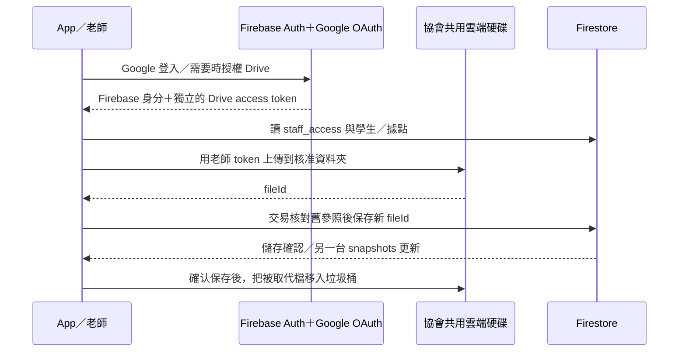

# MIG-A2：Google Drive 附件方案 v1

## MIG-A2 目的地已提供（2026-10-04）

使用者提供 https://drive.google.com/drive/folders/0AMxgkTtHIlRGUk9PVA 。截圖顯示「黃絲帶學生成長系統」位於共用雲端硬碟列表，畫面為根目錄，顯示 1 位使用者。候選 Drive／根目錄 ID 為 `0AMxgkTtHIlRGUk9PVA`，已取得目的地識別，後續不用再要求提供連結。根目錄型別、App OAuth 存取、老師成員／角色、據點隔離與上傳能力尚未經 API／雙帳號驗證。子資料夾結構尚未建立；本次只記錄，未操作 Drive 或重啟 agent。下方歷史「未找到 ID」由此更新取代。

## MIG-A2 最新範圍確認（2026-10-04）

- 使用者確認 source 切換先指不同 Google Drive 共用硬碟／資料夾；本階段不擴充其他儲存供應商。
- A／C 是獨立的附件開啟策略；source 是上傳目的地設定。切換閱讀方式不重傳、不搬檔、不修改附件參照；切換目的地只影響新上傳，既有附件保留原來源參照及權限。
- 使用者要求上一輪兩個 agent 作廢重來，兩 worktree 已封存，未整合入 PR。本輪只確認範圍與同步文件，agent 維持停止；不把「先這樣」當作重新開工指令。

日期：2026-10-04。狀態：**規劃供 review，尚未實作、啟用 Google provider 或變更雲端權限**。使用者要求先修當天封存，再在 branch 做 Google Drive 第一版規劃，至少三個方案，隔日查看。

## 2026-10-04 補充：頭像分流、附件閱讀與驗證範圍

- 使用者指定頭像使用 Firebase Storage，附件維持 Drive；這項偏好不代表同意升級或綁定帳單。正式專案先前盤點為 Spark、無 bucket，本輪未重新查雲端。官方現行規定 Firebase Storage 需 Blaze，即使只放小圖也一樣；實際費用依 region／用量。來源：https://firebase.google.com/docs/storage/faqs-storage-changes-announced-sept-2024 。頭像雲端啟用另待帳單決策，不阻擋附件程式開發。
- A／C 的附件上傳、儲存參照、權限及失敗復原相同，差別主要是開啟附件：A 在 App 內閱讀，C 交给 Drive／瀏覽器。原方案把頭像綁進選項不必要，已拆開。
- 更新建議：第一版先 C，A 留作後續可選增強，尚未視為使用者已選 C。若做 A，建議內嵌預覽僅 PDF、JPEG、PNG；Word／Excel 等交 Drive，不能預設 App 能開全部格式。預覽支援與允許上傳清單分開定義；C 也不保證 Drive 能預覽每種格式。
- PR #24 的 Drive 部分僅方案文件，沒有 A／B／C 任一實作。已核對程式落點與官方 API，未完成協會環境端到端 PoC；未找到實際 shared drive／folder ID。
- 前置資料：目標共用硬碟／資料夾連結、各據點可存取的老師或群組、兩個測試協會帳號（另指定一個無權限身分）、原 Firebase 帳號對應。管理員需處理 Google provider、OAuth、Drive API 與 iOS client 設定；登入／同意由本人操作，不收密碼或 token。
- 可先以注入設定與 fake adapter 完成附件流程、錯誤測試及畫面，再接真實帳號驗收。缺設定不以放寬權限繞過；真實權限及 UID 連結驗證仍是發布前必要條件。頭像帳單、A 的閱讀器可獨立延後。
- 粗估有效工程時間（非保證交期、不含等待管理員／iPad／發版）：帳號與雙帳號 PoC 2–4 小時；adapter、參照及失敗測試 4–6 小時；A 畫面／PDF圖片閱讀／快取 4–8 小時（C 約 2–3 小時）；雙 iPad 驗收與修正 2–4 小時。A 共 12–22 小時，C 共 10–17 小時；未知套件或帳號問題需重新估算，頭像雲端建置另計。

## 原三方案比較（以下頭像項目已由上方決策取代）

初版曾建議 **A：完整 App 內直傳與讀取**；本輪改建議 C，待使用者選案。原比較：它最貼近現在的操作：選學生 → 選附件／頭像 → 上傳 → 另一位授權老師即時看到。B 可減少 scope，但要先證明跨老師授權和 iPad 選檔體驗；C 可以較快交付附件上傳，但閱讀會跳出 App、頭像延後。

三案共同遵守已定方向：協會 Google 帳號經 Firebase Auth 登入，Drive API 使用**老師自己的 Google OAuth token**，檔案進協會共用雲端硬碟，Firestore 保存檔案參照。沒有 Functions、服務帳號、Apps Script、付費代理或新伺服器。

| 比較 | A：App 完整直傳／讀取（建議） | B：drive.file＋逐檔授權 | C：App 直傳，Drive 開啟閱讀 |
| --- | --- | --- | --- |
| 授權 | Internal，drive scope | Internal，drive.file；必要時由 Picker 授權既有檔 | Internal，drive scope |
| 老師操作 | 上傳、頭像及附件存取在原流程 | 上傳同樣直傳；未授權檔可能要選一次才能開 | App 上傳，按「開啟」交給 Drive／系統瀏覽器 |
| 跨老師檔案 | 依 Drive ACL；不需要每次逐檔授權 | **先做兩帳號 PoC**，不得預設 A 建的檔案 B 一定能讀或一定不能讀 | Drive 自身選帳號／登入與 ACL 決定能否開 |
| 頭像 | 同步遷移；受保護下載、記憶體快取 | 自動載入他人上傳頭像的授權是主要難點 | 第一階段僅預設頭像，停用新頭像上傳；第二階段補 A 的讀取 |
| 權限範圍 | OAuth 較廣，使用者可授權範圍不只 App 資料夾 | OAuth 較窄，以授權檔案為單位 | 與 A 相同，跳外部閱讀不會縮小 upload scope |
| 工程量（相對） | 中：需 token 更新、iPad 檔案開啟、圖片快取 | 中～高且未定：需 iPad Picker 與跨帳號 PoC | 小～中：省 App 內受保護閱讀／頭像，但切換 App 的體驗較差 |
| 適用 | 日常長期使用 | 可以接受多一步授權，且 PoC 確認可用 | 急需先能上傳附件，可接受暫無自訂頭像 |

這是規劃選項，不是已開發三個版本。B 若證明不符合兩台 iPad 直接讀取需求，就淘汰；不把未驗證的省權限方案當作已可交付。C 的頭像取捨須使用者選定，不能上線時才告知。

## 已核對的現有程式

| 現有位置 | 現況與建議修改 |
| --- | --- |
| `lib/domain/service/storage_service.dart` | 目前 Firebase Storage 的上傳、URL、刪檔。抽出最小附件儲存介面；Drive 實作放 domain/repo，不新增混合所有層的目錄 |
| `lib/domain/service/student_attachment_service.dart` | 保留上傳 → 儲存新參照 → 清理舊檔順序；Drive 與 Firestore 無共同交易，需明確處理兩端失敗 |
| `lib/domain/repo/students_repo.dart` | updateAvatar／updateProfileFile 保留既有據點授權；規劃加入 expectedPrevious 交易檢查，避免兩位老師同時替換遺失參照 |
| `lib/main/pages/student_detail_page/student_detail_main_section.dart` | 目前直接建立 StorageService；改由既有 DI 提供 adapter，畫面透過服務操作 |
| `lib/main/components/avatar/student_avatar.dart` | A 要改受保護圖片 bytes 載入與快取，不能把 OAuth token 塞 URL |
| `lib/domain/model/student/student_detail.dart` | 目前 avatar／profileFileName 是可空字串；不要把 fileId 誤送舊 Storage 路徑 |
| `lib/main.dart`、登入流程、iOS／Android 設定 | 加 Google provider、Google Sign-In client 配置及 Firebase UID 連結；不直接換掉目前可登入的 Email 帳號 |
| `firebase/roster.rules` | 現有附件欄位與 staff_access 據點權限保留。若加 provider/ref 格式，App／Rules 一起改與測試 |

建議的型別是 `AttachmentRef(provider, fileId)`；第一版可用既有 nullable string 保存帶 provider 的版本化值（例如 `drive:v1:<fileId>`），由單一 codec 解析；未加前綴的舊值維持 Storage。這是**待選定的相容方案**，不是已改資料格式。僅保存穩定 ID，不保存 OAuth token、暫時下載網址或 publicly shared URL。

Cloud 現況引用已合併的 [搬遷紀錄](../knowledge-base/backend-migrations.md)：正式專案無 Storage bucket、當時附件 0 個、Google provider 未開。本輪沒有用管理員帳號重新盤點；開工前須重新核對，不能把舊的 0 個當作永久事實。

## 資料流與權限界線

**Firestore Rules 不能替 Drive API 授權。** 只隱藏 App 的跨點按鈕不足以防止老師直接開 Drive 看其他據點。建議管理員先配置「每據點一個共用雲端硬碟＋對應 Google Group」，App 用 `locationId → driveId/folderId` 對照。只有一般子資料夾、不改 Drive ACL，無法當作隔離。跨點管理員加入兩邊；沒有權限的老師不能透過直接 Drive URL 存取。Drive 的權限與 capabilities 由 Google 檢查。[Drive sharing](https://developers.google.com/workspace/drive/api/guides/manage-sharing)

這個配置是建議，**尚未创建任何雲端硬碟或群組**。若協會一定只用一個既有 shared drive，需先驗證管理員能建立所需隔離的資料夾 ACL，再決定代替方案。轉點時附件留在哪個據點、誰可查看歷史附件要定義；不能自動搬到新點後讓舊點失去原本應保留的權限。

停權有兩層：staff_access 控制 App／Firestore；Drive 群組成員控制檔案。第一版由協會管理員同步撤除兩者，不承諾改 staff_access 即自動撤銷 Drive 權限。也不新增後端來偷偷同步群組。

## Google 登入、UID 與 scope

1. Firebase 登入 token 不等於 Drive access token。Google Sign-In 新版把身分驗證與 scope 授權分開；只在使用附件功能時補授權，不因拒絕 Drive scope 就清空學生草稿。實作前鎖定相容套件版本並測試 iOS／Android／Web。[Flutter 官方套件](https://pub.dev/packages/google_sign_in)
2. 舊帳號應先以原方式登入，核對 UID，再用 `linkWithCredential` 連結協會 Google 帳號；成功連結可沿用 Firebase 資料。不同 Email 或 credential-already-in-use 要由管理員核對，不建立第二個 UID 就複製權限。不能保證「Email 相同就一定自動保留 UID」。[Firebase account linking](https://firebase.google.com/docs/auth/flutter/account-linking)
3. `hd` 是 Google 選帳號提示，不能當作授權保證；採 Internal audience、有效的身分驗證與 staff_access 白名單。新 Rules 如加入 Email 網域與 email_verified，須先完成四個帳號連結／試登入，避免鎖死現有老師。[OpenID Connect](https://developers.google.com/identity/openid-connect/openid-connect)
4. `drive.file` 是使用者授權給 App 的逐檔存取，不能簡化成「一定只能看自己上傳的檔案」。A 用完整 `drive`，B 才驗證較小 scope 與 Picker；兩案都仍受 Drive ACL 限制。[Drive scopes](https://developers.google.com/workspace/drive/api/guides/api-specific-auth)
5. Internal apps 限同組織使用，可適用 OAuth 驗證豁免，但協會管理員仍可能限制 scope／App。啟用、同意畫面、iOS URL scheme、Android SHA 與 Web client 必須一起核對；不把 Internal 解釋為省略組織管理。[Internal use](https://support.google.com/cloud/answer/13464323?hl=en)

## 寫入與錯誤復原

Drive 請求支援 shared drives 的參數要按方法設定；讀取／列舉不能漏掉 shared-drive 支援，結果也不可以只查 My Drive。[Shared drive support](https://developers.google.com/workspace/drive/api/guides/enable-shareddrives)

- 上傳：小檔可直接傳；較大檔／不穩定網路用 resumable upload。保留 operation ID 和可恢復狀態，未知結果先核對再重送；不每次重試都新增一個副本。超時、取消及重開 App 的動作要可區分。[Upload guide](https://developers.google.com/workspace/drive/api/guides/manage-uploads)
- 明確上傳失敗：Firestore 不改，原檔仍在。Drive 已上傳、Firestore 明確拒絕：只清理本操作新檔；清理失敗保留待處理紀錄。
- Firestore 寫入結果未知：新舊檔都保留，重新核對 fileId；禁止把可能已成功連結的檔案當垃圾刪除。
- 两人同時替換：以 expectedPrevious 在 Firestore transaction 保護附件參照；輸的一方保留原畫面並提示重載，只清理自己的未連結檔。清理前核對目前參照，不移除其他老師剛上傳的新檔。
- 清理舊檔優先移入 Drive 垃圾桶；不能把永久刪除當成一般 Content manager 都可做的動作，先看 canTrash 等 capabilities。權限不足則報「附件已儲存，舊檔待清理」。第一版不排程自動刪檔。
- 401：嘗試一次重新取得授權，再要求登入／授權；403 分 scope、Drive ACL、配額；404 顯示不存在或無權存取，避免誤判為學生資料已刪。429／暫時錯誤有限次退避，不能無限等待。
- A 的照片與 PDF 用帶 Authorization header 的下載；快取以 UID＋fileId 隔離，登出／切帳號清除。開啟前確認權限，不能生成 anyone 公開連結。C 使用 Drive 的 webViewLink，仍可能需要在外部選擇正確 Google 帳號。[Download guide](https://developers.google.com/workspace/drive/api/guides/manage-downloads)
- 另一台收到新 fileId 才重載；不加 Drive 背景輪詢或 webhook。有人直接在 Drive 刪檔會在下次開啟／重載時顯示錯誤，不假稱有外部 Drive 即時事件同步。

## 費用判斷

三案都不新增運算後端。Google 目前文件列明 Drive API 免費門檻與 2026 配額調整，不能再寫成「任何用量永遠 0 元」。10 位老師每日例如 100 次上傳／500 次開啟、每檔 10 MB，檔案傳輸約 GB 等級，與文件列出的每日 1 TB 級門檻相差大；這只是規劃量級估算，實際需依方法的 quota units 和 Console 核對。頁面也預告超門檻計費細節另行公告。[官方配額與費用門檻](https://developers.google.com/workspace/drive/api/guides/limits)

**建議以不新增帳單綁定、不申請付費額度為上線條件。** Workspace 既有授權／儲存容量與 Firestore 讀寫仍屬原有資源；空間不足不能擅自購買。第一版限制檔案大小（建議 10 MB，待確認）、受控快取與有限重試，驗收後看實際用量。Spark 不等於 Drive 存取不受配額管理。

## 分階段交付與驗收

| 階段 | 交付 | 必須通過 |
| --- | --- | --- |
| 1：帳號與雙帳號 PoC | 開發環境 Google 登入／原 UID 連結／既有 shared drive 的合成檔案 | A 上傳、B 讀取；C 無據點權限直開 Drive 也被拒；切帳號／撤權有效 |
| 2：adapter 與資料參照 | 最小儲存介面、Drive adapter、provider codec、並行替換保護 | 上傳／保存／清理各階段失敗與未知結果；兩位老師替換不丟檔；舊字串不誤解析 |
| 3：正式頁面與預覽 | 沿用 SystemTheme 元件，Widgetbook memory adapter，不接真實 Drive | loading/error/retry、iPad 橫向與窄視窗、token 到期、取消後草稿保留 |
| 4：兩台 iPad 驗收後發布 | 管理員配置清單、使用方式、回退方式 | 登入、上傳 PDF／圖片、跨老師讀取、替換／刪除、登出清快取；紀錄实际用量 |

回退：未上線前不搬動正式附件；上線後若 Drive 暫停，只停新上傳、保留所有 Drive 參照與檔案，已遷移使用者須使用仍支援 Drive 讀取的版本。不能退回純 Storage 舊版並假裝 drive:v1 是 Storage 檔名。規則與 App 版本需相容後才 rollout。

## 明天需要決定（目前不阻擋交付這份規劃）

1. 選 A／B／C；建議 A。
2. 協會已存在的 shared drive／folder ID 與據點隔離方式；管理員核對 Google Group 成員。
3. 頭像一起做（A）或先用預設（C），附件大小上限是否先 10 MB。
4. 原四個 Firebase UID 對應哪個協會帳號；Email 登入建議連結驗收前先保留。
5. 轉點後，舊／新據點各可查看哪些歷史附件；這影響 Drive ACL，需先決定再寫自動搬檔。

本輪完成的是方案、程式落點、失敗處理及驗收設計。沒有啟用 Google provider、建立群組／Drive、授權 scope、安裝 App 套件或寫入真實檔案。
